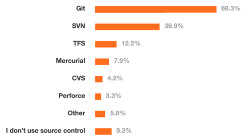
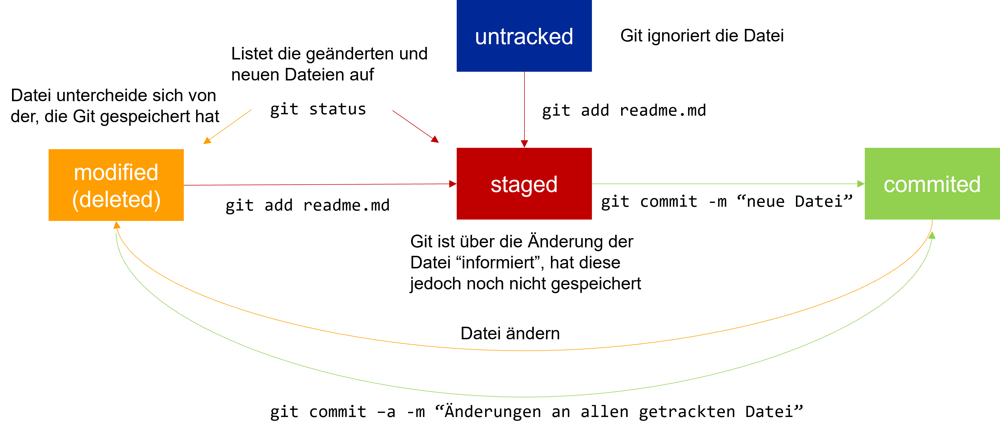

# Einheit 1: Git

### Lernziele


* Hintergründe, Sinn und Zweck von Versionsverwaltung **kennenlernen**
* Git Grundlagen **kennenlernen und anwenden können**
* **Verstehen** warum Git Workflows hilfreich sind

### Warum Versionsverwaltung? 

Es gibt alternative Bezeichnungen:

* Version Control Systems (VCS)
* Source Control Management (SCM)
* Revision Control Systems (RCS)

Herausforderung bei der Verwaltung von Quell-Code:

1. Software-Projekte können schnell sehr groß und unübersichtlich werden und **hunderte bzw. tausende von Code-Dateien enthalten.**
2. **Sehr viele** **Entwickler** (2, 10, hundert, oder sogar tausend) können an einem Projekt beteiligt sein.

Versionsverwaltungen können helfen diese Komplexität in den Griff zu bekommen, indem die **Änderungen an den Dateien über die Zeit hinweg protokolliert** werden.

Versionsverwaltungen lassen pro Datei die Änderungen nachvollziehen.\
Das heißt: **wer hat was wann geändert**.

So eine Historie ist auch **für einzelner Entwickler sinnvoll**:

* **Änderungen über die Zeit** nachvollziehen
* "**Zurückrollen**" zu einem bestimmten Zeitpunkt
* **Löschen** ohne Reue

Was wäre bei einem Entwickler die Alternative?

Viele (sehr viele) Kopien einer Datei anfertigen: jeden Tag, nach jeder Änderung. Wie werden die Änderungen protokolliert? Wie kann man das bei sehr vielen Dateien praktikabel gestalten.

Bei mehreren Entwicklern kommen weitere Herausforderungen hinzu:

* Wie kommen die anderen -Entwickler&#x20;
* Wie kann man sehen, we**r welche Änderungen** gemacht hat
* Wie lassen sich Konflikte auflösen, **wenn mehrere Entwickler Änderungen an der gleichen Datei** (insb. der gleichen Zeile) durchgeführt haben?

Was wäre die Alternative? Code-Dateien per E-Mail verschicken? &#x20;

**Versionierung** von Quell-Code erlaubt all die zuvor genannten Probleme zu lösen, außerdem lässt sich der

* **Zustand eines Projekts wiederherstellen**: zum **Testen**, für ein **Release** oder um die Einführung eines Fehlers zu finden bzw. den Bug zu beheben.\


#### Was nutzen Entwickler?

<figure><figcaption><p>Quelle: <a href="https://insights.stackoverflow.com/survey/2015">https://insights.stackoverflow.com/survey/2015</a></p></figcaption></figure>

<figure><figcaption><p>Quelle: <a href="https://insights.stackoverflow.com/survey/2018">https://insights.stackoverflow.com/survey/2018</a></p></figcaption></figure>

### Eine kurze Geschichte von Git

* Linux Community nutzte BitKeeper zur Verwaltung des Kernel Source Codes
* Durch Lizenzänderung des Herstellers konnte BitKeeper nicht mehr genutzt werden
* Linus Torvalds wollte ein System, das ähnlich BitKeeper funktionierte, aber die Nachteile der anderen Systeme nicht mehr aufwies (z.B. lange Zeiten bei Branches durch Kopieren aller Dateien)
* Innerhalb weniger Tage wurde die erste Version von Git entwickelt:
  * April 2005 Ankündigung des Projektes
  * April 2005 Self-Hosting des Projektes
  * Juni 2005 wurde der Linux 2.6 Kernel bereits durch Git verwaltet

#### Git Grundlagen

* _Git Repository_: Vereinfacht ausgedrückt, ein Verzeichnis, in dem die Dateien “überwacht” werden
* Metadaten (einschl. der Historie) werden in einem versteckten Unterverzeichnis `.git` verwaltet.
* Git ist eine verteilte Versionsverwaltung
* Keine Notwendigkeit eines zentralen Repositories
* _Clonen_ bzw. _Forken_ eines Repositories legt eine vollständige Kopie an. Änderungen können dann in das ursprüngliche Repository zurückgeführt (engl. merge) werden.
* Jede Datei in dem überwachten Verzeichnis, befindet sich in einem bestimmten Zustand:

<figure><figcaption></figcaption></figure>

#### Nützliches für den Einstieg 

**Lokale Änderungen** anzeigen (engl. unstaged changes): `git diff [dateiname]`

**Änderungshistorie**: `git log` für Commits, `git –p log` für ein Preview

**Checkout**: Der Checkout einer früheren Version eines Repositories ersetzt alle Dateien mit dieser Version (time travel)

**Branches**: Alle Änderungen werden in dem Branch (dt. Zweig) gespeichert ohne den Hauptzweig (engl. master od. main branch) zu beeinflussen („kaputt zu machen“)

**Remote**: “Entfernte“ Kopie eines Repositories (z.B: GitLab, GitHub) – Achtung: Selbst auf GitLab/GitHub ist nicht das zentrale Repository, sondern nur eine entfernte Kopie Synchronsiation mit dem lokalen Repository z.B. mit `git push`, `git pull`

**Stash**: Änderungen, die noch nicht committet wurden, können mit `git stash` „zwischengespeichert“ und mit `git stash apply` wieder hergestellt werden

**Fork**: Server-seitiger Clone eines Repositories (vorrangig auf GitHub genutzt)


### Aufgaben

1. Stellen Sie sicher, dass Git auf Ihrem Rechner vorhanden ist
   1. MacOS: [https://git-scm.com/download/mac](https://git-scm.com/download/mac)
   2. Windows:  [https://git-scm.com/download/win](https://git-scm.com/download/win)
   3. Linux: [https://git-scm.com/download/linux](https://git-scm.com/download/linux)
2. Sofern Sie noch keinen Zugang um [Hochschul-GitLab](https://git.it.hs-heilbronn.de/) haben, melden Sie sich dort einmalig an. \
   **Hinweise**: Sie erhalten beim ersten Versuch eine Fehlermeldung, dadurch lern das System jedoch Ihren Account kennen und Sie können einem Repository zugewiesen werden.
3. Melden Sie sich im jeweiligen ILIAS-Raum ([SEB ](https://ilias.hs-heilbronn.de/ilias.php?baseClass=ilrepositorygui\&ref\_id=360705)bzw. [AIB](https://ilias.hs-heilbronn.de/ilias.php?baseClass=ilrepositorygui\&ref\_id=607216)) an. Abonnieren Sie dort das Forum. Hierüber erhalten Sie wichtige Informationen (z.B. Ausfall der Vorlesung etc.):\
   
4.  Finden Sie ein Team-Mitglied (2er-Gruppen).\
    Laden Sie in ILIAS unter Abgaben eine JSON-Datei in folgendem Format hoch.\
    \


    ```
    {
        "name": "",
        "members": [
          {
              "lastname": "Mustermann",
              "firstname": "Max",
              "id": 12345,
              "email": "maxmu@stud.hs-heilbronn.de"
          },
          {
              "lastname": "Musterperson",
              "firstname": "Maxi",
              "id": 676890,
              "email": "maxim@stud.hs-heilbronn.de"
          },
        ]
     }
    ```

    \
    \
    Im Laufe des Tages erhalten Sie von GitLab das Benachrichtigen über Ihr Repository.&#x20;

### Hausaufgabe

**Git Grundlagen**\
Sofern noch nicht geschehen, erarbeiten Sie den Kurs [Version Control with Git](https://www.udacity.com/course/version-control-with-git--ud123) bis zum übernächsten Termin.&#x20;

**Git Übung**\
Erstellen Sie über Git-Commits ein Dialog aus Shakespear\`s "Rome und Julia". Am Besten erarbeiten Sie diese Aufgabe bereits im Team, da beide Team-Mitglieder abwechselnd einchecken müssen.

Nutzen Sie Git-Befehle wie `git add`, `git commit`, `git push`, `git pull` und `git log`, um ihre Änderungen zu verwalten und den Dialog im Verlauf des Git Logs nachzuvollziehen.

Folgender Dialog ist über Commit-Messages und Commits im Log zu erstellen:&#x20;

> Romeo: Ist es Tag?

> Julia: Nein, es ist die Nachtigall, die den Morgen anzeigt, nicht die Lerche, deren Pfeifen das Wachstum des Tages weckt. Jocund Day steht auf der Jagd und weckt die Jagd.

> Romeo: Weil sie sich in ihren Augen widerspiegeln würde, bis ich die Rückkehr von Lucentio sehe, Ich will dir mit meinen Augen zeigen, was Shakespeare sagt: „Guten Tropfen Salz“, du vergisst dann schnell.

> Julia: Nun, da du willst, werde ich dich vergeben, Wenn du mir gehorchst liebevoll. Willkommen wird der Regen bald nachlassen.

> Romeo: Meine Ehegatten hätten eine bessere Erscheinung, wenn es nicht für die Zähne wäre, die den weißen Verstand einfärben. Wir haben gute Absichten, zu schlafen.

Das Commit log soll am Ende so aussehen (via `git log)`:&#x20;

```
commit c9a3e2e (HEAD -> main)
Author: Romeo <romeo@example.com>
Date:   Thu Mar 10 12:00:00 2024

    Romeo: Ist es Tag?

commit a7f8d4b
Author: Julia <julia@example.com>
Date:   Thu Mar 10 11:50:00 2024

    Julia: Nein, es ist die Nachtigall, die den Morgen anzeigt,
          nicht die Lerche, deren Pfeifen das Wachstum des Tages weckt.
          Jocund Day steht auf der Jagd und weckt die Jagd.

commit f32e89d
Author: Romeo <romeo@example.com>
Date:   Thu Mar 10 11:40:00 2024

    Romeo: Weil sie sich in ihren Augen widerspiegeln würde,
          bis ich die Rückkehr von Lucentio sehe,
          Ich will dir mit meinen Augen zeigen,
          was Shakespeare sagt: „Guten Tropfen Salz“,
          du vergisst dann schnell.

commit b57a6c1
Author: Julia <julia@example.com>
Date:   Thu Mar 10 11:30:00 2024

    Julia: Nun, da du willst, werde ich dich vergeben,
          Wenn du mir gehorchst liebevoll.
          Willkommen wird der Regen bald nachlassen.

commit e1c4d77
Author: Romeo <romeo@example.com>
Date:   Thu Mar 10 11:20:00 2024

    Romeo: Meine Ehegatten hätten eine bessere Erscheinung,
          wenn es nicht für die Zähne wäre, die den weißen Verstand einfärben.
          Wir haben gute Absichten, zu schlafen.
```

Stellen Sie sicher, dass sich im Root-Verzeichnis Ihres Repositories eine Datei `dialog.txt` befindet, in der die jeweiligen Text-Passagen eingecheckt sind. Die Textpassagen entsprechend der jeweiligen Log-Message. &#x20;

### Weiterführendes Material

* Git Command-line Tool: [https://github.com/nschneid/git-command-overview](https://github.com/nschneid/git-command-overview)
* GitHub: [https://github.com/](https://github.com/)
* GitLab: [https://about.gitlab.com/](https://about.gitlab.com/)
* The case for Git in 2015: [http://www.netinstructions.com/the-case-for-git/](http://www.netinstructions.com/the-case-for-git/)
* Pro Git Book: [http://git-scm.com/book](http://git-scm.com/book)
* **Udacity Kurs:** [**https://www.udacity.com/course/version-control-with-git--ud123**](https://www.udacity.com/course/version-control-with-git--ud123)
* Git User‘s Manual: [http://schacon.github.com/git/user-manual.html](http://schacon.github.com/git/user-manual.html)
* Git – SVN Crashcourse: [http://git.or.cz/course/svn.html](http://git.or.cz/course/svn.html)
* Learn Git in Y minutes: [https://learnxinyminutes.com/docs/git/](https://learnxinyminutes.com/docs/git/)
* Coding Blocks Podcast: Comparing Git Workflows: [https://www.codingblocks.net/podcast/comparing-git-workflows/](https://www.codingblocks.net/podcast/comparing-git-workflows/)
* Gitflow Cheatsheet: [https://danielkummer.github.io/git-flow-cheatsheet/](https://danielkummer.github.io/git-flow-cheatsheet/)
* Gitflow: [https://nvie.com/posts/a-successful-git-branching-model/](https://nvie.com/posts/a-successful-git-branching-model/)
* Atlassian‘s Gitflow Zusammenfassung: [https://www.atlassian.com/git/tutorials/comparing-workflows/gitflow-workflow](https://www.atlassian.com/git/tutorials/comparing-workflows/gitflow-workflow)
* Microsoft Recommendation: [https://docs.microsoft.com/en-us/azure/devops/repos/git/git-branching-guidance?view=azure-devops\&viewFallbackFrom=vsts](https://docs.microsoft.com/en-us/azure/devops/repos/git/git-branching-guidance?view=azure-devops\&viewFallbackFrom=vsts)
* Git Workflows: [http://drincruz.github.io/slides/git-workflow-comparison/#/8](http://drincruz.github.io/slides/git-workflow-comparison/#/8)
* Git Spiel Oh my Git! :[https://ohmygit.org/](https://ohmygit.org/)
* Auschecken von Commits: [https://www.git-tower.com/learn/git/faq/git-checkout-commits/](https://www.git-tower.com/learn/git/faq/git-checkout-commits/)
* Wenn was schief geht: [https://ohshitgit.com/](https://ohshitgit.com/)
* Learn Git Branching: [https://learngitbranching.js.org/](https://learngitbranching.js.org/)

\
