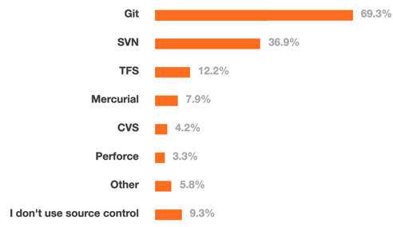
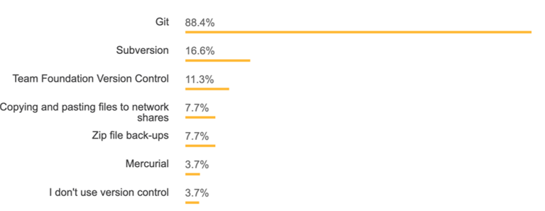
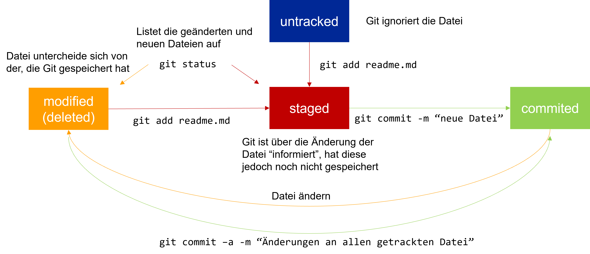
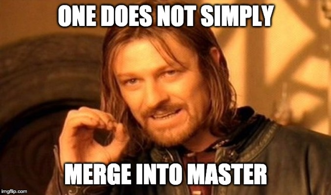

# Einheit 1: Git

### Lernziele

* Hintergründe, Sinn und Zweck von Versionsverwaltung **kennenlernen**
* Git Grundlagen **kennenlernen und anwenden können**
* **Verstehen** warum Git Workflows hilfreich sind

### Warum Versionsverwaltung? 

Es gibt alternative Bezeichnungen:

* Version Control Systems (VCS)
* Source Control Management (SCM)
* Revision Control Systems (RCS)

Herausforderung bei der Verwaltung von Quell-Code:

1. Software-Projekte können schnell sehr groß und unübersichtlich werden und **hunderte bzw. tausende von Code-Dateien enthalten.**
2. **Sehr viele** **Entwickler** (2, 10, hundert, oder sogar tausend) können an einem Projekt beteiligt sein.

Versionsverwaltungen können helfen diese Komplexität in den Griff zu bekommen, indem die **Änderungen an den Dateien über die Zeit hinweg protokolliert** werden.

Versionsverwaltungen lassen pro Datei die Änderungen nachvollziehen.\
Das heißt: **wer hat was wann geändert**.

So eine Historie ist auch **für einzelner Entwickler sinnvoll**:

* **Änderungen über die Zeit** nachvollziehen
* "**Zurückrollen**" zu einem bestimmten Zeitpunkt
* **Löschen** ohne Reue

Was wäre bei einem Entwickler die Alternative?

Viele (sehr viele) Kopien einer Datei anfertigen: jeden Tag, nach jeder Änderung. Wie werden die Änderungen protokolliert? Wie kann man das bei sehr vielen Dateien praktikabel gestalten.

Bei mehreren Entwicklern kommen weitere Herausforderungen hinzu:

* Wie kommen die anderen -Entwickler&#x20;
* Wie kann man sehen, we**r welche Änderungen** gemacht hat
* Wie lassen sich Konflikte auflösen, **wenn mehrere Entwickler Änderungen an der gleichen Datei** (insb. der gleichen Zeile) durchgeführt haben?

Was wäre die Alternative? Code-Dateien per E-Mail verschicken? &#x20;

**Versionierung** von Quell-Code erlaubt all die zuvor genannten Probleme zu lösen, außerdem lässt sich der

* **Zustand eines Projekts wiederherstellen**: zum **Testen**, für ein **Release** oder um die Einführung eines Fehlers zu finden bzw. den Bug zu beheben.

#### Was nutzen Entwickler?

<figure><figcaption>
Quelle: <a href="https://insights.stackoverflow.com/survey/2015">https://insights.stackoverflow.com/survey/2015</a>
</figcaption></figure>

<figure><figcaption>
Quelle: <a href="https://insights.stackoverflow.com/survey/2018">https://insights.stackoverflow.com/survey/2018</a>
</figcaption></figure>

### Eine kurze Geschichte von Git

* Linux Community nutzte BitKeeper zur Verwaltung des Kernel Source Codes
* Durch Lizenzänderung des Herstellers konnte BitKeeper nicht mehr genutzt werden
* Linus Torvalds wollte ein System, das ähnlich BitKeeper funktionierte, aber die Nachteile der anderen Systeme nicht mehr aufwies (z.B. lange Zeiten bei Branches durch Kopieren aller Dateien)
* Innerhalb weniger Tage wurde die erste Version von Git entwickelt:
  * April 2005 Ankündigung des Projektes
  * April 2005 Self-Hosting des Projektes
  * Juni 2005 wurde der Linux 2.6 Kernel bereits durch Git verwaltet

#### Git Grundlagen

* _Git Repository_: Vereinfacht ausgedrückt, ein Verzeichnis, in dem die Dateien “überwacht” werden
* Metadaten (einschl. der Historie) werden in einem versteckten Unterverzeichnis `.git` verwaltet.
* Git ist eine verteilte Versionsverwaltung
* Keine Notwendigkeit eines zentralen Repositories
* _Clonen_ bzw. _Forken_ eines Repositories legt eine vollständige Kopie an. Änderungen können dann in das ursprüngliche Repository zurückgeführt (engl. merge) werden.
* Jede Datei in dem überwachten Verzeichnis, befindet sich in einem bestimmten Zustand:

<figure><figcaption></figcaption></figure>

#### Nützliches für den Einstieg 

**Lokale Änderungen** anzeigen (engl. unstaged changes): `git diff [dateiname]`

**Änderungshistorie**: `git log` für Commits, `git –p log` für ein Preview

**Checkout**: Der Checkout einer früheren Version eines Repositories ersetzt alle Dateien mit dieser Version (time travel)

**Branches**: Alle Änderungen werden in dem Branch (dt. Zweig) gespeichert ohne den Hauptzweig (engl. master od. main branch) zu beeinflussen („kaputt zu machen“)

**Remote**: “Entfernte“ Kopie eines Repositories (z.B: GitLab, GitHub) – Achtung: Selbst auf GitLab/GitHub ist nicht das zentrale Repository, sondern nur eine entfernte Kopie Synchronsiation mit dem lokalen Repository z.B. mit `git push`, `git pull`

**Stash**: Änderungen, die noch nicht committet wurden, können mit `git stash` „zwischengespeichert“ und mit `git stash apply` wieder hergestellt werden

**Fork**: Server-seitiger Clone eines Repositories (vorrangig auf GitHub genutzt)

#### Git Workflows

Trotz oder gerade wegen der verteilten Verwaltung kann so einiges schief gehen. Auch wen auf dem main bzw. master immer zurückgerollt werden kann, gilt: \

<figure><figcaption>
Bildquelle: <a href="https://imgflip.com/">https://imgflip.com/</a>
</figcaption></figure>

Das Team hält sich an spezielle Regeln, **wann neue Branches erzeugt werden** und wann diese wieder **zurück in den master bzw. main gemerged werden** dürfen.&#x20;

Das Ziel ist immer das gleiche: **Der master bzw. main soll zu jeden Zeitpunkt stabil sein**, d.h. im besten Fall für den fehlerfreien Build einer aktuellen und lauffähigen Software verwendet werden können.

Dabie gibt es verschiedene Ansätze für Git Workflows.

* Centralized Workflow
* Feature Branch Workflow
* Gitflow
* Fork & Merge
* Microsoft Git Branching Strategy

In GitOps wird ein anderer Ansatz verfolgt: Hier werden möglichst alle Änderungen direkt im master/main durchgeführt. Dies ist aber nur durch einen sehr hohen Grad an Automatisierung im Build- und Testprozess möglich. Teaser: Das wird in der Vorlesung DevOps behandelt und spielt zunächst keine Rolle für uns.

### Weiterführendes Material

#### Git

* Git Command-line Tool: [https://github.com/nschneid/git-command-overview](https://github.com/nschneid/git-command-overview)
* GitHub: [https://github.com/](https://github.com/)
* GitLab: [https://about.gitlab.com/](https://about.gitlab.com/)
* The case for Git in 2015: [http://www.netinstructions.com/the-case-for-git/](http://www.netinstructions.com/the-case-for-git/)
* Pro Git Book: [http://git-scm.com/book](http://git-scm.com/book)
* **Udacity Kurs:** [**https://www.udacity.com/course/version-control-with-git--ud123**](https://www.udacity.com/course/version-control-with-git--ud123)
* Git User‘s Manual: [http://schacon.github.com/git/user-manual.html](http://schacon.github.com/git/user-manual.html)
* Git – SVN Crashcourse: [http://git.or.cz/course/svn.html](http://git.or.cz/course/svn.html)
* Learn Git in Y minutes: [https://learnxinyminutes.com/docs/git/](https://learnxinyminutes.com/docs/git/)
* Coding Blocks Podcast: Comparing Git Workflows: [https://www.codingblocks.net/podcast/comparing-git-workflows/](https://www.codingblocks.net/podcast/comparing-git-workflows/)
* Gitflow Cheatsheet: [https://danielkummer.github.io/git-flow-cheatsheet/](https://danielkummer.github.io/git-flow-cheatsheet/)
* Gitflow: [https://nvie.com/posts/a-successful-git-branching-model/](https://nvie.com/posts/a-successful-git-branching-model/)
* Atlassian‘s Gitflow Zusammenfassung: [https://www.atlassian.com/git/tutorials/comparing-workflows/gitflow-workflow](https://www.atlassian.com/git/tutorials/comparing-workflows/gitflow-workflow)
* Microsoft Recommendation: [https://docs.microsoft.com/en-us/azure/devops/repos/git/git-branching-guidance?view=azure-devops\&viewFallbackFrom=vsts](https://docs.microsoft.com/en-us/azure/devops/repos/git/git-branching-guidance?view=azure-devops\&viewFallbackFrom=vsts)
* Git Workflows: [http://drincruz.github.io/slides/git-workflow-comparison/#/8](http://drincruz.github.io/slides/git-workflow-comparison/#/8)
* Git Spiel Oh my Git! :[https://ohmygit.org/](https://ohmygit.org/)
* Auschecken von Commits: [https://www.git-tower.com/learn/git/faq/git-checkout-commits/](https://www.git-tower.com/learn/git/faq/git-checkout-commits/)
* Wenn was schief geht: [https://ohshitgit.com/](https://ohshitgit.com/)
* Learn Git Branching: [https://learngitbranching.js.org/](https://learngitbranching.js.org/)

#### Misc

* One Does not simply walk into Mordor Meme: [https://knowyourmeme.com/memes/one-does-not-simply-walk-into-mordor](https://knowyourmeme.com/memes/one-does-not-simply-walk-into-mordor)\
