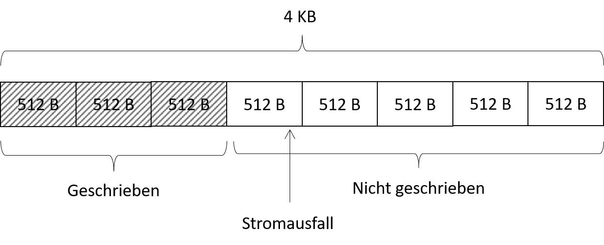
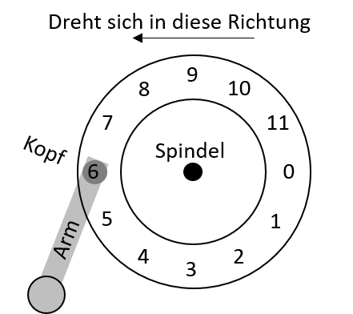
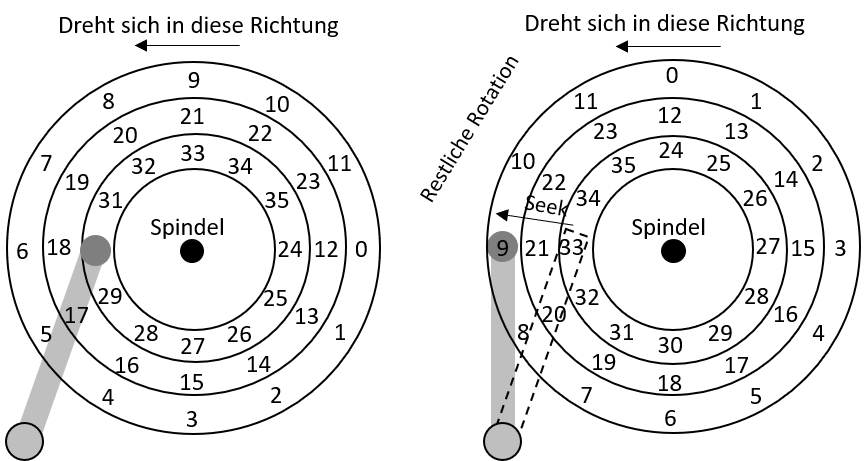
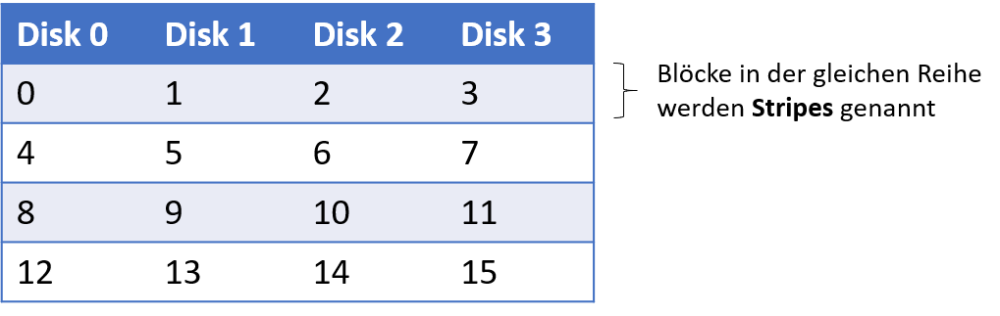
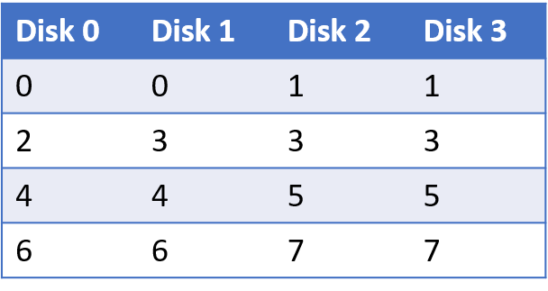
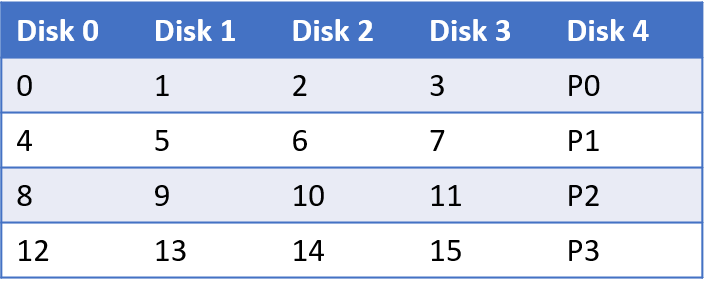
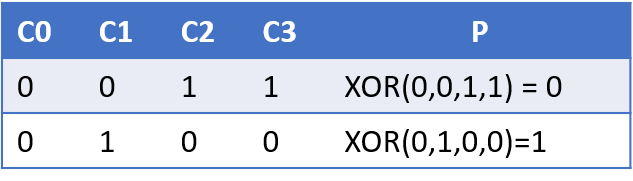
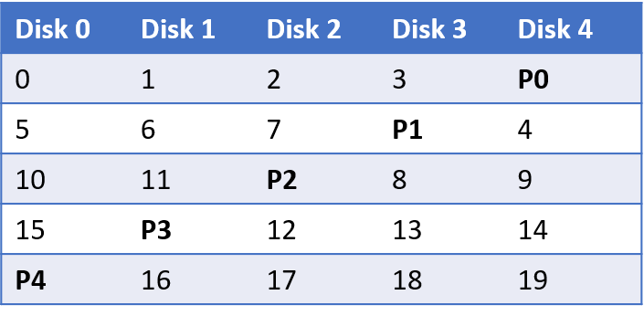

# Einheit 11: Harddisks & Dateisysteme

## Lernziele und Kompetenzen

Den Aufbau von Hard Disk Drives und RAID-Systemen **kennen lernen** und die Prinzipien bei der Ansteuerung durch das Betriebssystem **verstehen**.

## Datenpersistenz

* Hard Disk Drives (dt. Festplatten sind die seit Jahrzehnten am weit verbreitetsten Art Daten zu speichern.
* Dateisysteme hängen dabei stark von den darunterliegenden Geräten ab
  * Wie speichern moderne Hard Disks überhaupt Daten ab?
  * Wie sieht das Interface hierfür aus?
  * Wie sind die Daten konkret angeordnet und wie wird darauf zugegriffen?
  * Wie lässt sich mit „Disk Scheduling“ die Leistung verbessern?
  * Welche Konsequenz hat der Wandel von klassischen Festplatten hin zu Solid State Disks (Abk. SSD)?

### **Das Interface**

Der Aufbau ist im Grundprinzip immer ähnlich

* Das Laufwerk besteht aus einer Anzahl von sog. **Sektoren** (i.d.R. in Form von 512-Byte Blöcken)
* Jeder Block kann individuell gelesen und geschrieben werden
* Alle Sektoren sind nummeriert 0 bis 𝑛−1 (bei 𝑛 Sektoren)
* Multi-Sektor-Operationen sing möglich (und gängig)
* Viele Dateisysteme lesen 4KB oder mehr auf einmal
* Atomare Schreiboperationen sind nur auf 512-Byte Blöcke zugesichert

### Torn Write

Was bedeutet atomare Schreiboperationen sind nur auf 512-Byte Blöcken zugesichert?

<figure><figcaption></figcaption></figure>

Nur die ersten drei Blöcke wurden geschrieben, obwohl der Stromausfall erst sehr spät bei der Schreiboperation von Block 4 aufgetreten ist.

### **Inoffizielle Annahmen über Disks**

*   Annahmen, die von vielen Clients getroffen werden (**unwritten contract**):

    * Auf zwei nahe beieinander liegende Blöcke kann schneller zugegriffen werden, als auf weit entfernt liegende
    * Der Zugriff auf fortlaufende Böcke (engl. sequential read/write) ist der schnellste Zugriff überhaupt und gewöhnlich schneller als der wahlfreie Zugriff (engl. random access)

    > Angenommen, Sie schreiben einen Treiber für (konventionelle) Festplatten unter diesen Annahmen und morgen tauscht jemand die Festplatten gegen Solid State Disks aus, was passiert dann?

## Festplattengemoetrie

### **Grundlegende Geometrie**

* Eine oder mehrere Scheiben (engl. platter), jede mit je zwei Seiten
* Magnetische Oberfläche aus Eisenoxid - oder Kobalt-Deckschicht (engl. surface)
* Achse bzw. Spindle (engl. spindle)
* Schreib-/Lesekopf (engl. disk-head)
* Arm mittels dem der Schreib-/Lesekopf positioniert wird (engl. disk arm)
* Daten sind in konzentrischen Kreisen (engl.tracks) angeordnet
* Umdrehung wird in RPM (rotations per minute) gemessen.
* Typische Werte heutzutage von 7.200 bis 15.000 RPM
* Interessant wird die Umdrehungszeit, bei 10.000 RPM sind dies ca. 6ms

### **Vereinfachte Festplatte**

* Einige (vereinfachende) Annahmen
  * Ein Track
  * Track besteht aus 12 Sektoren bzw. Blöcken (Sektoren)
  * Jeder Block besteht aus 512 Byte
  * Die Scheibe dreht sich gegen der Uhrzeiger Sinn

<figure><figcaption></figcaption></figure>

### Rotationa Delay

* Rotational Delay oder auch Rotational Latency – Zeit bis sich der gesuchte Sektor unter dem Schreib-Lese-Kopf befindet
* Eine vollständige Umdrehung dauert 𝑅
* Suchen wir Sektor 0 und starten bei Sektor 6, ist das Delay 𝑅/2
* Der Worst-Case wäre im Beispiel zuvor ein Start bei 5, hier wird fast eine ganze Rotation benötigt und das Delay beträgt somit fast 𝑅

### Seek Time

* In Wirklichkeit besitzen HDDs **sehr viele** Tracks und der Schreib-/Lesekopf muss permanent ausgerichtet werden
  * Hier: Kopf über dem innersten Track muss zum äußersten bewegt werden (engl. seek):
  * Rotation und Seek sind mit die teuersten Operationen einer Festplatte
  * Seeking besteht aus vier Phasen:
    * Beschleunigung (engl. acceleration)
    * Schub bei voller Geschwindigkeit (engl. coasting)
    * Abbremsung (engl. deceleration)
    * Einschwingzeit (engl. settling time) mit 0,5 bis 2ms

<figure><figcaption></figcaption></figure>

### **Transfer und andere unwichtige Dinge**

Erst wenn der Kopf korrekt positioniert ist (stellen Sie sich vor, er wäre nur ungefähr auf dem richtigen Track🤦‍♂️) findet der Transfer (engl.transfer) statt.

Um dass sequentielle Lesen zu ermöglichen, nutzen manche Disks ein sog. Spurversatz (engl. **trackskew**) an, damit keine Latenz nach dem Neupositionieren entsteht, wenn die Daten auf einem anderen Sektor weitergeführt werden.

Außen befinden sich mehr Sektoren (Physik rulez!), daher werden Platten oft in Zonen (engl. multi-zoned disks). Äußere Zonen besitzen dann mehr Sektoren als innere.

Schreib-/Lesecache zur Performance-Steigerung. Beim Schreiben kann sofort nach dem Cachen bestätigt werden (engl. **writeback**) oder erst nach dem Schreiben auf Platte (engl. writet**h**rough).\

**I/O Zeiten**

Wie setzt sich nun die Zeit für einen I/O-Zugriff zusammen?

$$
T_{I/O}=T_{seek} +T_{rotation}+T_{transfer}
$$

Für den Plattenvergleich gerne genutzt: I/O Rate:

$$
R_{I/O} = {\frac{Size_{transfer}}{T_{I/O}}}
$$

<figure><figcaption></figcaption></figure>

## Disk Scheduling

* Aufgrund der hohen Kosten für Disk Zugriffe entscheidet der Disk Scheduler über die Zugriffe:
  * Anders als bei Prozessen kann man bei Plattenzugriffen die Dauer gut berechnen
  * Auf Basis von Seek-Zeiten und der Rotation Delay kann der kürzeste Job gefunden werden

### **Shortest Seek Time First (SSTF)**

* Anordnung der Jobs nach Track – die Anfrage mit dem am nächst gelegenen Track wird zuerst gewählt
* Problem: Die Disk Geometrie ist dem Betriebssystem nicht bekannt
* Anstelle dessen kann der nächst gelegen Block verwendet werden (nearest-block-first, Abk. NBF)
* Problem 2: Starvation– Bei einem fortlaufenden Strom von Anfragen auf z.B. die inneren Tracks würden Anfragen auf die äußeren ignoriert
* Wie kann dieses Problem gelöst werden?

### **SCAN**

* Anfragen werden von den äußeren zu den inneren Tracks und wieder zurück etc. abgearbeitet (engl. sweep)

### **C-SCAN (Circular SCAN)**

* Anstelle in beiden Richtungen werden Anfragen immer von den äußeren Tracks abgearbeitet
* Fairer gegenüber den äußeren und inneren Tracks, da reines SCAN zweimal die mittleren Tracks trifft
* Allerdings werden SCAN/C-SCAN nicht annähernd einem SJF-Ansatz gerecht

### **Shortest Positioning Time First (SPTF)**

* Ausgangspunkt s. vorherige Abbildung
* Sollte nun Track 8 oder 16 zuerst gewählt werden?
* Abhängig von Seek-Zeit und Rotation-Delay
* Löst eigentlich unsere vorherigen Probleme
* Problem: Das Betriebssystem kennt meist nicht die Track-Grenzen nicht und weiß nicht wo sich der Schreib-Lese-Kopf gerade befindet
* Daher wird SPFT meist innerhalb des Drives selbst implementiert

manchmal auch: Shortest Access Time First (SATF)

### **Weiter Herausforderungen**

* Früher wurde das gesamte Scheduling im Betriebssystem realisiert – früher waren die Disks „einfacher“ gebaut.
* Heute besitzen Festplatten einen komplexen Scheduler auf dem Disk Controller, der exakte Daten über die internen Positionen hat.
* Das Betriebssystem schickt die Requests an die Disk, die es am geeignetsten hält und die Disk kümmert sich um den Rest.
* I/O Merging: Requests, die nahe aneinander liegende Sektoren betreffen, sollten möglichst zusammengefasst werden, da dies den Overhead für das Betriebssystem reduziert.
* Wie lange soll der Scheduler warten, bis eine I/O-Anfrage abgearbeitet wird? Es könnte ja noch eine „bessere“ Anfrage kommen, so dass die Disk effizienter genutzt werden kann.

## RAID-Systeme

Festplatten gehören zu den **langsamsten** Komponenten in einem Rechner. Wenn eine Festplatte ausfällt, sind die persistierten Daten verloren. Außer Sie haben ein Backup, aber das ist hier nicht der Punkt, wicht hier ist jedoch: RAID ist kein Backup!

Zunächst die Frage: Wie kann ein großes, schnelles und zuverlässiges Speichersystem geschaffen werden?

* Von außen betrachtet sieht ein RAID wie _eine_ Festplatte aus.
* Intern ist ein RAID jedoch ein höchst komplexes System mit zahlreichen Vorteilen:
  * Performance, Speicherplatz (Kapazität) und Zuverlässigkeit
  * RAID-Systeme verkraften außerdem den Ausfall einzelner Festplatten

### **Interface**

Für das Dateisystem sieht ein RAI- System aus wie eine einzelne Festplatte (warum es das nicht ist klären wir später).

* Bei einem Request durch das Betriebssystem, muss das RAID ermitteln auf welche Disk (bzw. abhängig vom RAID Level, auf welche Disks) zugegriffen werden muss.
* Da die Daten auf mehrere Disks verteilt sind, müssen mehrere physikalische I/O-Zugriffe pro logischen I/O-Zugriff stattfinden

### RAID Charakteristika

Auf Basis welcher Kriterien können RAID-Systeme evaluiert werden?

#### **Kapazität**

* Wie viel effektiver Speicherplatz ist verfügbar, wenn 𝑁 Disks mit 𝐵 Blöcken verwendet werden? Ohne Redundanz sind dies 𝑁⋅𝐵
* Wenn zwei Kopien vorgehalten werden (engl. mirroring) wären dies (𝑁⋅𝐵)∕2
* Verschiedene RAID-Level liegen irgendwo dazwischen

#### **Zuverlässigkeit**

* Zur Vereinfachung gehen wir derzeit von einem einzigen Fehlermodell aus: Eine Disk fällt komplett aus, einem sog. Fail-Stop.
* Des weiteren gehen wir davon aus, dass der RAID-Controller dies auch direkt feststellen kann.
  * Wie viele Disks können ausfallen, so dass das jeweilige RAID-Design immer noch funktionsfähig ist?

Es gibt natürlich noch mehr Fehlerfälle, die wir später betrachten!

#### **Performance**

* Die Performance ist nicht ganz einfach zu bestimmen:
  * Hängt vom jeweiligen Workload ab
  * Wie hoch ist die Schreibe- oder Lesegeschwindigkeit?
  * Wie wir vorher gelernt haben, hängt dies auch von den eingesetzten Disks ab

### RAID Level

#### RAID Level 0

* Keine Redundanz
* Mehrere Disks werden genutzt, um die Kapazität zu erhöhen (engl.striping)
* Einfachste Form: Blöcke werden über die Disks verteilt
* Werden Blöcke nun sequentiell gelesen, kann dies parallelisiert werden!

**Stripes**

Blöcke in der gleichen Reihe werden _Stripes_ genannt.

<figure><figcaption></figcaption></figure>

**Chunk Size**

* Besser: Mehrere Blöcke auf einer Disk
* Hier: Zwei 4-KB Blöcke bevor zur nächsten Disk gesprungen wird

<figure><figcaption></figcaption></figure>

* Performance Auswirkung:
  * Kleine Chunk Sizes: Dateien werden über viele Disks verteilt
  * Große Chunk Sizes: Intra-File Parallelität wird reduziert
  * Richtige Größe: schwer zu bestimmen bzw. „it depends“

**RAID-0 Analyse**

**Kapazität**

* Bei 𝑁 Disk mit je 𝐵 Blöcken liefert RAID-0 ein perfektes Ergebnis: 𝑁⋅𝐵

**Zuverlässigkeit**

* Perfekt, was die Ausfallwahrscheinlichkeit angeht: Bei einem Fehler sind die Daten futsch!

**Performance**

* Bei einem Zugriff auf einen einzelnen Block: Vergleichbar mit einzelner Disk
* Bei sequentiellen Zugriffen: Volle Parallelität
* Bei wahlfreien Zugriffen 𝑁⋅𝑅 MB/s mit&#x20;

$$
𝑅=(𝐴𝑚𝑜𝑢𝑛𝑡𝑜𝑓𝐷𝑎𝑡𝑎)/(𝑇𝑖𝑚𝑒𝑡𝑜𝐴𝑐𝑐𝑒𝑠𝑠)
$$

Für eine detaillierte Berechnung sei hier auf OSTEP Kapitel 38.4 verwiesen

### RAID Level 1

**Mirroring**

* Jeder Block wird im System auf eine andere Disk kopiert (bzw. gespiegelt)
* Hier: RAID-10 bzw. RAID 1+0, nutzt gespiegelte Paare von Disk
* Alternativ: RAID-01 bzw. RAID 0+1, besteht aus zwei RAID-0 Arrays, die gespiegelt sind

<figure><figcaption></figcaption></figure>

**Kapazität**

* Es wird nur die Hälfte der Kapazität genutzt: (𝑁⋅𝐵)∕2 und somit teuer

**Zuverlässigkeit**

* Ausfall einer Diks wird verkraftet, im vorherigen Fall können sogar Konstellationen von Disks ausfallen (z.B. Disk 0 und 2), darauf sollte man aber nicht wetten

**Performance**

* Einzelne Leseoperation vergleichbar mit einer einzelnen Disk
* Für einen Schreibzugriff müssen jedoch zwei (parallele) physikalische Schreiboperationen durchgeführt werden, im Worst-Case muss auf den langsamsten Schreibprozess gewartet werden (z.B. aufgrund von Rotation Delay)
* Sequentielle Schreib- und Leseoperationen dauern (𝑁/2⋅𝑆) MB/s mit 𝑆=(𝐴𝑚𝑜𝑢𝑛𝑡𝑜𝑓𝐷𝑎𝑡𝑎)/(𝑇𝑖𝑚𝑒𝑡𝑜𝐴𝑐𝑐𝑒𝑠𝑠) bzw. die Hälfte des Höchstdurchsatzes
* Wahlfreie Leseoperationen sind mit 𝑁⋅𝑅 MB/s die beste Operation für RAID-1, wogegen wahlfreie Schreiboperationen mit 𝑁/2⋅𝑅 MB/s weniger geeignet sind, da zwei physikalische Schreiboperationen simultan durchgeführt werden müssen.

Für eine detaillierte Berechnung sei auch hier auf OSTEP Kapitel 38.4 verwiesen

#### RAID Level 4

* Nutzung eines sog Paritätsbits
* Benötigt weniger Speicherplatz als gespiegelte RAIDs, jedoch auf Kosten der Performance
* Mittels der **XOR**-Funktion wird das Paritätsbit berechnet

<figure><figcaption></figcaption></figure>

**Parity-Bit**

* Invariante
* Pro Zeile gerade Anzahl von 1en, einschl. des Paritätsbits
* RAID muss dies sicherstellen
* Beim Ausfall einer Zeile C (s.o.) kann diese wiederhergestellt werden
  * Wie? XOR auf die verbleibenden Spalten ausführen
* Aber bei Blöcken?
* Bitweises XOR auf den ganzen Block (z.B. 4 KB)

<figure><figcaption></figcaption></figure>

**Kapazität**

* 1 Disk für Paritäten ergibt eine Gesamtkapazität (𝑁−1)⋅𝐵

**Zuverlässigkeit**

* RAID-1 erlaubt den Ausfall einer Disk

**Performance**

* Sequentielle Leseoperationen können alle Disks (ohne die Paritätsdisk) nutzen und liefern so einen Maximaldurchsatz von (𝑁−1)⋅𝑆 MB/s
* Bei einem sog. Full Stripe Write wird ein gesamter Stripe auf einmal beschrieben und der Paritätsblock kann direkt mit berechnet werden, alle Schreiboperationen können parallel stattfinden (effizienteste Schreiboperation im RAID-4)
* Die effektive Bandbreite bei sequentiellen Schreiboperationen ist dabei (𝑁−1)⋅𝑆 MB/s
* Wahlfreie Leseoperationen liegen bei (𝑁−1)⋅𝑅 MB/s
* Beim Schreiben eines einzelnen Blocks muss das Paritätsbit des Stripes neu berechnet werden

**Variante 1: Additive Parity**

* Alle bestehenden Blöcke (parallel) lesen und mit dem neune Block `XOR`
* Neu berechneter Paritätsblock und neuer Block können parallel geschrieben werden

**Variante 2: Subtractive Parity**

* Alter Wert wird gelesen, ist dieser mit dem neuen Wert identisch muss das Paritätsbit nicht geändert werden, falls doch, muss das Paritätsbit umgedreht werden
* Bei ganzen Blöcken (z.B. 4 KB) wie in RAID-4 sind dies 4096 mal 8 Bit.
* Der Einsatz des jeweiligen Verfahrens hängt also wieder davon ab („it depends“)

> Auf jeden Fall wird die Paritätsdisk zum Flaschenhals

RAID Level 5

* Grundlegend gleich zu RAID-4, jedoch mit den Paritätsblöcken über die versch. Disks verteilt (engl. rotating parity)
* Flaschenhals wird somit beseitigt

<figure><figcaption></figcaption></figure>

**RAID-5 Analyse**

* Die meisten Werte sind identisch zu RAID-4
* Wahlfreie Leseoperationen sind etwas besser, da alle Disks genutzt werden können
* Wahlfreie Schreiboperationen verbessern sich signifikant, da Requests nun parallel ausgeführt werden können.

## Übungsaufgaen

### Einfache XOR Berechnung

Gegeben sind zwei Binärzahlen: 1010 und 1100. Berechnen Sie das Ergebnis der XOR-Operation zwischen diesen beiden Zahlen.

1 XOR 1 = 0\
0 XOR 1 = 1\
1 XOR 0 = 1\
0 XOR 0 = 0

Die gesuchte Binärzahl ist demnach 0110.\
\
In diesem Fall handelt es sich um **gerade Parität** (auch als “even parity” bezeichnet). Die XOR-Operation zwischen den beiden Binärzahlen 1010 und 1100 ergibt die Binärzahl 0110, die eine gerade Anzahl von Einsen enthält. Daher ist dies ein Beispiel für gerade Parität.&#x20;

### XOR Berechnung mit mehreren Datenblöcken

* **Disk 1 =**1111
* **Disk 2 =**1110
* **Disk 3 =**1100
* **Disk 4 =**1000

**Die Berechnung des ersten Bits jedes Datenblocks ergibt folgende Berechnung**

1 XOR 1 XOR 1 XOR 1&#x20;

\= ((1 XOR 1) XOR 1) XOR 1

\= (0 XOR 1) XOR 1

\= 1 XOR 1n

\= 0

**Die Berechnung des zweiten Bits jedes Datenblocks ergibt folgende Berechnung**

1 XOR 1 XOR 1 XOR 0&#x20;

\= ((1 XOR 1) XOR 1) XOR 0

\= (0 XOR 1) XOR 0

\= 1 XOR 0

\= 1

**Die Berechnung des dritten Bits jedes Datenblocks ergibt folgende Berechnung**

1 XOR 1 XOR 0 XOR 0&#x20;

\= ((1 XOR 1) XOR 0) XOR 0

\= (0 XOR 0) XOR 0

\= 0 XOR 0

\= 0

**Die Berechnung des letzten Bits jedes Datenblocks ergibt folgende Berechnung**

1 XOR 0 XOR 0 XOR 0&#x20;

\= ((1 XOR 0) XOR 0) XOR 0

\= (1 XOR 0) XOR 0

\= 1 XOR 0

\= 1

Die Berechnung ergibt demnach folgenden Paritätsblock:

**Disk 5 =** 0101

