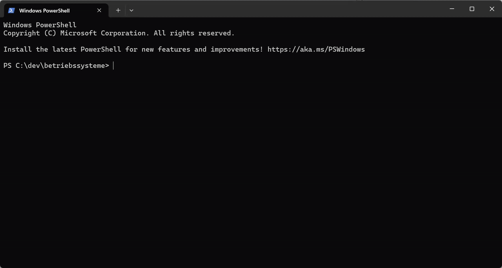
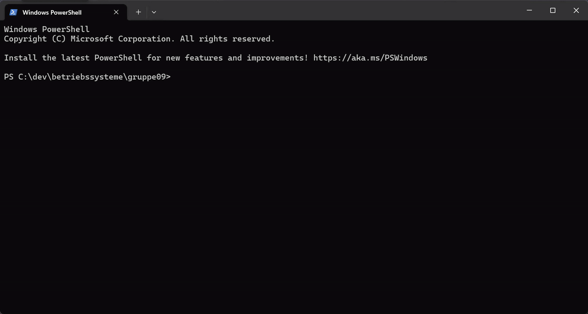
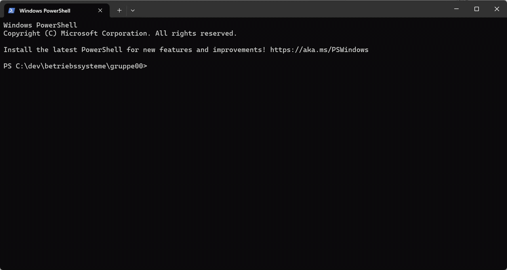

# Einheit 2: Hausaufgabe

## Teil 1

In diesem Kurs erstellen wir vorrangig ausführbare Programme mit C. Lesen Sie sich hierzu die folgenden drei Wikipedia-Artikel durch:

* [PE Format](https://en.wikipedia.org/wiki/Portable_Executable)
* [a.out Format](https://en.wikipedia.org/wiki/A.out)
* [ELF Format](https://en.wikipedia.org/wiki/Executable_and_Linkable_Format)

## Teil 2

* Bearbeiten Sie den C-Crashkurs:  [https://github.com/aheil/hhn-c](https://github.com/aheil/hhn-c)
* Nach der Bearbeitung des Crashkurs erstellen Sie ein C Programm, das
  * einen String "Hello World" in einem Char-Array speichert und
  * eine Ausgabe wie die folgende auf dem Bildschirm erzeugt:

```
Text: Hello World
Speicheradresse:  0x7ffdbf4a3a10
```

**Hinweis**: Die Speicheradresse weicht bei Ihnen selbstverständlich ab.

## Abgabe

Jedes Team-Mitglied checkt das Code-File in Ihrer Gruppe unter dem Ordner `hello_world` in einem **eigene Branch** ein.

* **Jedes** Team-Mitglied erstellt einen eigenen _branch_ der exakt so heißt wie Ihr alias. (z.B. in meinem Fall _aheil_).
* Jedes Team-Mitglied erstellt in diesem Branch den Ordner `hello_world` .
* In diesem branch checkt das jeweilige Team-Mitglied den eigenen Code ein und pusht diesen check-in in das Repository.
* Konkret bedeutet dies, im _main_ branch befindet sich keine Datei, in jedem branch der Team-Mitglieder befindet sich jeweils die eigene Datei.
* Achten Sie auf die korrekte Schreibweise der Ordner (Kleinschreibung, Unterstrich, Alias).&#x20;

## Arbeiten mit GitLab, Git und Branches

**Voraussetzungen**

1. Sie können sich erfolgreich am hochschuleigenen GitLab anmelden.
2. Sie haben einen öffentlichen SSH Schlüssel in GitLab hinterlegt.
3. Sie haben Git lokal auf Ihrem Rechner installiert.&#x20;

**Repository Clonen**

1.  Loggen Sie sich zunächst am hochschuleigenen GitLab mit Ihren Hochschul-Zugangsdaten ein. Danach wählen Sie das Repository des Kurses bzw. Ihrer Gruppe aus. Kopieren Sie nun die URL Ihres Repositories (Code / _Clone with SSH)._\


    <figure><figcaption></figcaption></figure>
2. Wechseln Sie nun auf die Eingabeaufforderung (CMD; Windows Terminal, Terminal, Shell etc.) auf Ihrem Rechner und navigieren Sie in den Ordner, in den Sie das Repository klonen möchten.\
   \
   **Hinweis**: Der Name des Repositories wird beim Klonen als Ordnername verwendet, d.h. Sie müssen eine Ebene "darüber" die folgenden Befehle ausführen. Bsp.: Sie möchten das Repo im Ordner `c:\dev\betriebssysteme\gruppe00` ablegen, dann führen Sie die Befehle auf der Konsole im Ordner `c:\dev\betriebssysteme` aus.
3. Klonen Sie nun das Repository in dem Sie folgenden Befehl ausführen&#x20;

```
git clone HIER_DIE_VORHER_KOPIERTE_ULR_EINFUEGEN
```

Während des Clon-Vorganges werden Sie nach dem Passwort des SSH-Schlüssels gefragt. Geben Sie diesen ein.&#x20;

Im vorliegenden Beispiel sieht der Vorgang auf Konsole wie folgt aus: &#x20;

<figure><figcaption></figcaption></figure>

**Repository einrichten**

Um in dem Repository einzuchecken, ist es erforderlich Name und e-Mail des Autors zu setzen. Hierfür wechselt man in den Ordner des Repositories und nutzt den Befehl `git config`&#x20;

```
git config user.name "Andreas Heil"
git config user.email "andreas.heil@example.org"
```

**Hinweis**: Kursteilnehmer:innen verwenden hierfür Ihren voll Namen als auch die Hochschuladresse. GitLab nutzt die E-Mail Adresse zur Identifikation des Autors des Check-Ins.&#x20;

<figure><figcaption></figcaption></figure>

**Git Branch**

Um in Git einen neuen Branch anzulegen, gibt es mehrere Möglichkeiten. Die einfachste ist:

```
git branch BRANCHNAME
```

Hierdurch wird ein Branch erstellt, allerdings bleibt man im aktuellen Branch (z.B. _main_). Um in den neuen Branch zu wechseln nutzt man den Befehl

```
git switch BRANCHNAME
```

Um sich alle verfügbaren Branches anzeigen zu lassen, nutzt man den Befehl&#x20;

```
git branch -a
```

<figure><figcaption></figcaption></figure>
