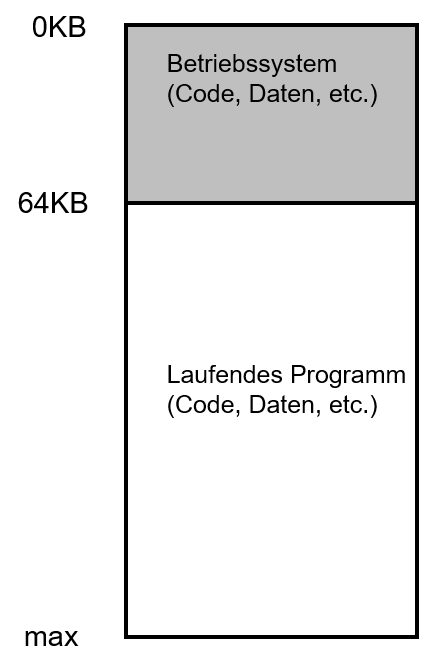
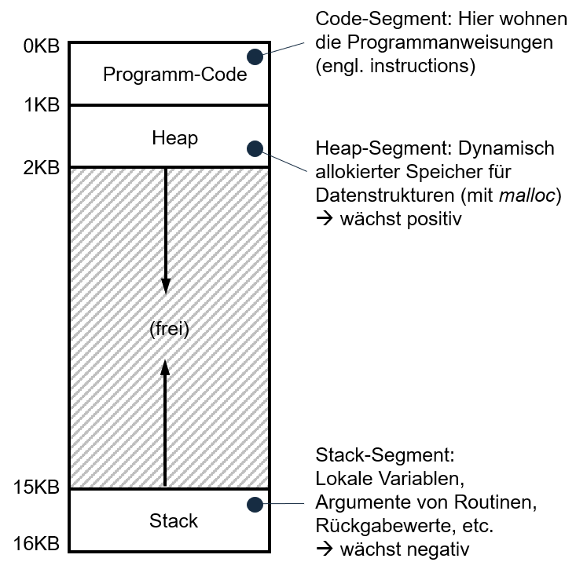

# Einheit 3: Speicher

## Lernziele und Kompetenzen

* Grundlagen von Adressräume und Speichervirtualisierung **kennen lernen**
* Unterschiedliche Adressierung von Programminstruktionen, Heap und Stack **verstehen**

### Früher war alles viel einfacher:

* Das Betriebssystem war **vollständig** im Hauptspeicher präsent
* **Ein laufendes Progr**amm (= Prozess) konnte den Rest des Speichers nutzen
* Dadurch was alles sehr einfach zu programmieren

**Beispiel**

* Betriebssystem im Speicherbereich 0KB bis 64KB
* Das laufende Programm nutzt den gesamten restlichen Speicher ab 64KB

<figure><figcaption></figcaption></figure>

## **Adressräume**

* Jeder Prozess hat einen eigenen Speicherinhalt.
* Im Beispiel zuvor passt dieser der gesamte Rest des verfügbaren Speichers.
*   Gibt es mehr Prozesse, muss der Speicher aufgeteilt&#x20;

    werden, d.h. jeder Prozess erhält einen eigenen Speicherbereich, seinen sog. **Adressraum** (engl. address space).&#x20;
* Auf diesen Adressraum hat nur der Prozess selbst Zugriff, kein anderer Prozess kann auf diesen Adresraum zugreifen
* Genügt der Speicher nicht, muss bei jedem Context Switch der Adressraum weggespeichert und später neu geladen werden

<figure><figcaption></figcaption></figure>

* Adressräume sind also einfach zu verwendende Abstraktionen des Speichers
* Ein Adressraum beinhaltet alle Bestandteile des laufenden Programms

## Aufbau von Adressräumen

* **Code**
  * Einfach zu laden, da nicht veränderbar
* **Stack** und **Heap**
  * Wachsen und schrumpfen
  * Durch entgegengesetzte Anordnung ist dies gleichzeitig möglich
  * Heap wächst "positiv"
  * Stack wächst "negativ"

<figure><figcaption></figcaption></figure>

* Da der Prozess nicht weiß, dass er sich in einem Adressraum befindet, »denkt« er wurde bei Adresse 0 KB in den Speicher geladen
* Für jeden Prozess beginnt der Adressraum an Adresse 0 KB&#x20;
* Allerdings liegt der Prozess dabei jedoch wo ganz anders
* Hier sprechen wir von einer sog. **virtuellen Adresse** (engl. virtual address)
* Bei jedem Zugriff auf eine Variable, eine Konstante oder bei Laden eines Befehls aus dem Code-Segment muss daher die Adress in die echte physikalische Adresse umgerechnet werden.

## Speicherarten: Stack

* Wird implizit (automatisch) reserviert
* Compiler reserviert für die Variable `x` entsprechend Speicher auf dem Stack
* Speicher wird bei Aufruf von `func` alloziert und beim Verlassen der Routine wieder freigegeben

```
void func() {
  int x; // declares an integer on the stack
  ...
}
```

## Speicherarten: Heap

* Speicher muss explizit durch Entwickler alloziert werden
* Hinweis: Compiler reserviert Speicher für Pointer, z.B. `int *x`, auf dem Stack
* Prozess fordert Speicher auf dem Heap für ein Integer an
* Zurück kommt die Speicheradresse, an der der Integer Wert auf dem Heap liegt

```
void func() {
  int *x = (int *) malloc(sizeof(int));
  ...
}
```

## Speicher reservieren

Speicher für eine Fließkommazahl reservieren:

```
double *d = (double *) malloc(sizeof(double));
```

* Compiler kennt die Größe des Datentyps
* Sie auch? 8 Byte, 32-Bit Fließkommazahlen, war schon dran, oder?

Array für 10 Integer-Werte reservieren

```
int *x = malloc(10 * sizeof(int));
```

## Speicher freigeben

Allozierten Speicher wieder freigeben

```
double *x = malloc(10 * sizeof(int));
…
free(x);
```

**malloc, free und das Betriebssystem**

* `malloc` und `free` beziehen sich immer nur auf den virtuellen Adressraum eines Prozesses
* Auch wenn ein Speicherleck gebaut wird und der gesamte Heap voll läuft gilt:
  * Das Betriebssystem holt sich nach Prozessende den gesamten Speicher zurück
  * Kann aber Probleme bei langlaufenden Prozessen (Web Server o.ä. machen)
* Viel größeres Problem wenn im Betriebssystem selbst ein Speicherleck enthalten ist
* `malloc` und `free` sind selbst keine SysCalls
* `brk` und `sbrk` sind SysCalls zum Ändern des Heaps
* `mmap` zum Erzeugen eines neuen Speicher-Mappings in den virtuellen Adressraum

## Ziele der Speichervirtualisierung mittels Adressräumen

* Transparenz: Der Prozess weiß nichts von seinem Glück und denkt er greift auf physikalischen Speicher zu
* Effizienz: In Bezug auf Speicher- als auch Zeit (z.B. unterstützt durch Hardware-Features)
* Sicherheit: Prozess müssen voreinander geschützt sein

## Typische Fehler beim Umgang mit Speicher

Was könnte beim Verwalten von Speicher schon schiefgehen?

\
**Vergessen Speicher zu reservieren**

```
char *src = “hello world”;
char *dst;                // Speicher nicht reserviert
strcpy (dst, scr); 
```

▶ Resultiert in sog. » Segmentation Fault«

Korrekt wäre:

```
char *src = “hello world”;
char *dst = (char *) malloc(strlen(src) + 1);
strcpy (dst, scr); 
```

### **Nicht genügend Speicher reserviert**

```
char *src = “hello world”;
char *dst = (char *) malloc(strlen(src)); // String um 1 Zeichen zu kurz
strcpy (dst, scr); 
```

* Das kann laufen, kann aber auch abstürzen
* Je nachdem ob `malloc` hier ggf. ein Byte mehr alloziert
* Verlassen sollten Sie sich darauf allerdings nicht… 🙈

### **Speicher reserviert, aber vergessen zu initialisieren**

* Egal ob initialisiert oder nicht, es wird auf jeden Fall etwas aus dem Speicher gelesen
* Und zwar das was vorher drin war 😲
* Nennt sich dann »Uninitialized Read«

### **Speicher nicht freigegeben**

* Ein Klassiker
* Hatten wir schon einmal zu Beginn der Vorlesungsreihe
* Herzlichen Glückwunsch, Sie haben ein Speicherleck (engl. memory leak) gebaut 🤦‍♂️
* Kann man auch bei höheren Programmiersprachen erreichen, indem Referenzen nicht »aufgeräumt« wer

### **Speicher freigegeben obwohl er noch benötigt wird**

* Klingt schon so, als wäre das keine gute Idee
* Nennt sich »Dangling Pointer«
* GGf. noch benötigte Daten können ab dann durch erneutes `malloc` überschreiben werden
* Man sollte denken, das sollte kein Unterschied machen
* Ergebnis ist allerdings nicht exakt definiert
* Nennt sich »Double Free«
* Immer wieder gut, um die zugrundeliegenden Bibliotheken zur Speicherverwaltung maximal zu verwirren 😵

### **Speicher mehrfach freigeben**

* Man sollte denken, das sollte kein Unterschied machen
* Ergebnis ist allerdings nicht exakt definiert
* Nennt sich »Double Free«
* Immer wieder gut, um die zugrundeliegenden Bibliotheken zur Speicherverwaltung maximal zu verwirren 😵

\
\
\


\


\
