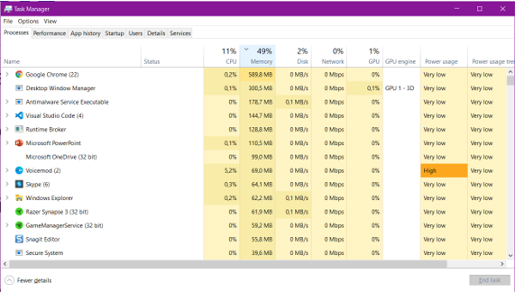
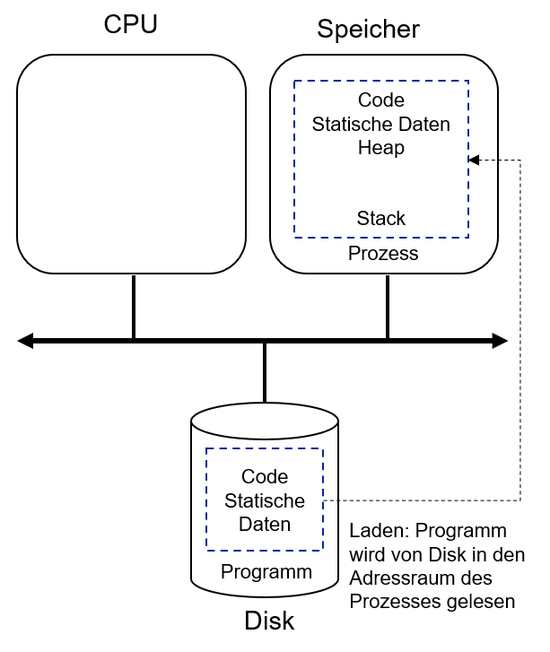

# Einheit 3: Virtualisierung

## Lernziele und Kompetenzen

* **Verstehen** wie sich Prozesse zusammensetzen und Prozesse vom Betriebssystem verwaltet werden.
* **Verstehen** wie Prozesse im Betriebssystem gesteuert werden.

## Prozesse

**Was ist eigentlich ein Prozess?**

Einfache Antwort: Ein ausgeführtes bzw. laufendes Programm.

**Was ist dann überhaupt ein Programm?**

Es Besteht aus **Code** (Bits) und ggf. **statischen Daten,** wartet auf der Festplatte und tut eigentlich nichts. Erst durch die Ausführung wird ein Programm zum Prozess.

**Was benötigt ein Programm, um ausgeführt zu werden?**

Es wird **Speicher** benötigt, in den der auszuführende Code und die Daten geladen werden können.  Zur Ausführung außerdem eine **CPU** benötigt.&#x20;

<figure><figcaption>
Windows Task Manager zeigt die laufenden Prozesse
</figcaption></figure>

In der Regel laufen mehr Prozesse auf dem PC, als CPUs vorhanden sind.&#x20;

**Wie kann die Illusion vieler CPUs geschaffen werden, wenn es nur eine (oder wenige) physikalische CPUs gibt?**\
\
Hierzu betrachten wir, wie Prozesse im Rechner abgelegt sind:&#x20;

* Programmanweisungen bzw. Instruktionen (engl. instructions), also der ausführbaren Maschinencode liegen im Speicher.
* Daten, die im Prozess gelesen oder geschrieben werden, liegen im Speichern.
* Der Prozess muss einen Teil des Speichers daher adressieren können (**adressierbarer Speicher** bzw. engl. address space).
* Die CPU liest die Instruktionen und Daten aus Registern und schreibt in diese Register. Hierzu gehören der **Program Counter** (Abk. PC) oder auch Instruction Counter (Abk. IC): Hier steht die Adresse der nächsten Anweisung, die ausgeführt werden soll.
* Dateien, auf die der Prozess zugreift, um Daten daraus zu lesen oder zu schreiben, Liste der Dateien, die der Prozess aktuell geöffnet hat, also eine **Liste der Dateien, die der Prozess aktuell geöffnet hat.**
* Weiter werden Register für I/O-Informationen (Input/Output), Stack Pointer, Frame Pointer, Funktionsparameter, lokale Variablen und Rücksprungadressen (engl. return address) benötigt. - mehr dazu später.&#x20;

> Alle diese Informationen können jederzeit »weggespeichert« und »wiederhergestellt« werden

Übungsaufgaben:&#x20;

Jeder findet heraus, wie viele CPUs bzw. Kerne im eigenen Rechner vorhanden sind.&#x20;

## Virtualisierung

Sehr vereinfacht betrachtet:

* Wir geben jedem Prozess die CPU für eine kurze Zeitspanne
* Dieses sog. **Timesharing** erzeugt eine Illusion mehrerer CPUs
* Konsequenz: Programm läuft langsamer, da die CPU »geteilt« wird

### **Was wird für Virtualisierung benötigt?**

* Methoden und Protokolle für die grundlegende Funktionalität wie das Stoppen und Starten von Prozessen
* Zusätzliches Regelwerk (engl. policies), z.B. Regeln wie viele Prozesse auf einer CPU ausgeführt werden dürfen
* Jemand oder etwas, der bzw. das steuert, welcher Prozess als nächstes ausgeführt wird

## Prozess API&#x20;

### **Prozess-API**

Programmierschnittstelle (engl. Application Programming Interface, Abk. API, hier process api), die jedes Betriebssystem beinhalten muss (wird später noch weiter vertieft).

* `create`: Ausgewähltes Programm wird gestartet und ein neuer Prozess erzeugt
* `destroy`: Falls sich ein Programm nicht von selbst beendet, ist dies sehr hilfreich
* `wait`: Durchaus sinnvoll zu warten, bis ein Prozess von selbst aufhört zu laufen
* `status`: Statusinformation von Prozessen abfragen&#x20;

Weitere Möglichkeiten sind je nach Betriebssystem unterschiedlich, z.B.: `suspend` und `resume` um Prozesse anzuhalten und weiterlaufen zu lassen.

### **Wie wird ein Prozess erzeugt?**

1. Voraussetzung: Ein Programm muss in ausführbarer Form vorliegen (mehr dazu später)
2. Programm und statische Daten werden in den Adressraum des Prozesses geladen
   * »Früher«, z.B. bei einem C64 wurde das gesamte Programm in den Speicher geladen (engl. eagerly loading)
   * »Heute« wird nur der benötigte Programm-Code und die erforderlichen Daten geladen (engl. lazy loading).  Um dieses sog. »Lazy Loading« zu verstehen, werden wir uns später noch mit »Paging« und »Swapping« befassen müssen.
3. Der sog. **Stack** bzw. »Runtime Stack« wird zugewiesen.
   * C nutzt den Stack für lokale Variablen, Funktionsparameter und Rücksprungadressen.
4. Das Betriebssystem füllt z.B. die Parameterlisten
   * Bei C sind dies `argc` und `argv`, so dass das Programm (hier die `main`-Funktion) auf die Werte zugreifen kann.
   * Kennen Sie auch aus Java
5. Nun wird noch der **Heap** reserviert
   * In C für dynamischen Speicherzuordnung via `malloc()` und `free().`
   * Exkurs: **Memoryleaks** baut man übrigens, indem man in C vergisst `free()`aufzurufen.
6. Das Betriebssystem unterstütz nun den Prozess, indem es z.B. dem Prozess mehr Speicher gibt, wenn der Heap vergrößert werden muss.
7.  Nun werden noch Input/Output-Resourcen erzeugt (später mehr dazu).

    * Unter UNIX sind dies die drei sog. [File Descriptors](https://sites.ualberta.ca/dept/chemeng/AIX-43/share/man/info/C/a\_doc\_lib/aixuser/usrosdev/std\_input\_output.htm):
      * **Standard Input (0)**
      * **Standard Output (1)** und
      * **Standard Error Output (2)**\

    <figure><figcaption>
Starten eines Programmes
</figcaption></figure>

\
