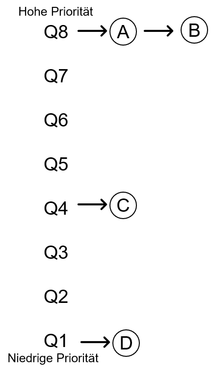
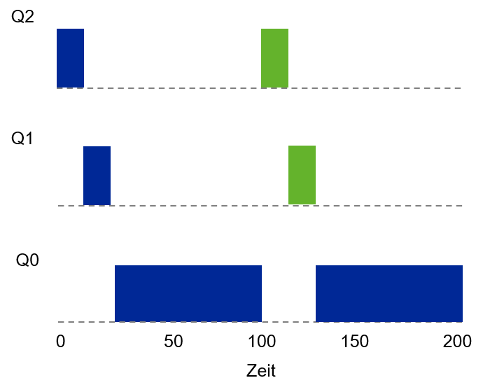
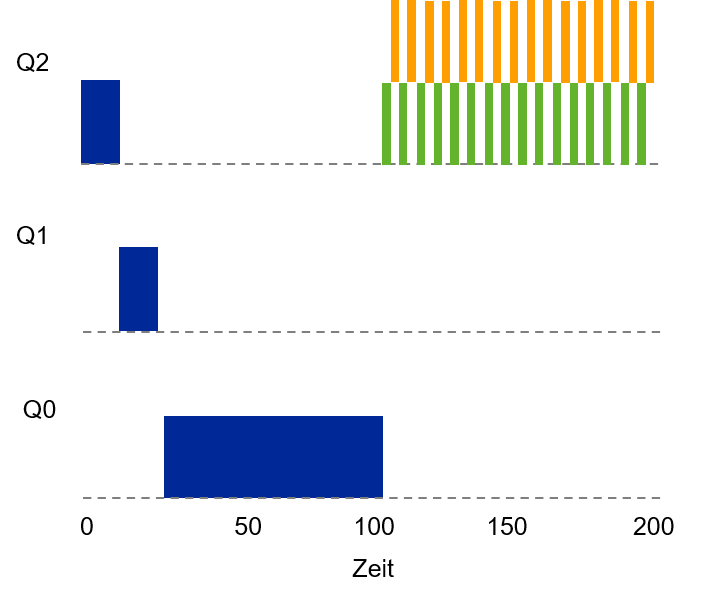

# Einheit 6: Fortgeschrittene Scheduler

### Lernziele

* Funktionsweise realer Scheduler **kennen lernen**

## I/O und Overlapping

* Wir haben zwei Typen von Schedulern kennen gelernt
  * SJF/STCF optimiert Turnaround-Zeiten, ist jedoch ungünstig für Antwortzeiten
  * RR optimiert die Antwortzeit, ist aber ungünstig für die Turnaround-Zeit
* Es gibt auf Basis des vorangehenden Abschnitts noch zwei Annahmen/Restriktionen, die »aufgelöst« werden müssen
  4. Alle Jobs verwenden ausschließlich die CPU
  5. Laufzeit eines jedes Jobs ist bekannt

**Input/Output**

* Lösen wir daher die nächste Restriktion: Ab sofort können Jobs auch I/O-Operationen aufrufen
* Scheduler muss nun entscheiden wann eine I/O-Operation durchgeführt wird, da in der Zeit der laufende Prozess die CPU nicht nutzen kann und sich somit im Status »blocked« befindet
* Scheduler kann demnach in dieser Zeit einen anderen Job laufen lassen
* Ist die I/O-Operation fertig (wird über Interrupt angezeigt), wird der zuvor geblockte Job wieder auf »ready« gesetzt
* Ab jetzt kann er Job potentiell wieder la

**Overlapping**

* Schlechte Ressourcen-Nutzung

<figure><figcaption></figcaption></figure>

Bessere Ressourcen-Nutzung dank Overlapping

<figure><figcaption></figcaption></figure>

### Prozessdauer

**In Wirklichkeit haben wir kein Wissen über Prozessdauer**

* Als letzte Restriktion lösen wir nun die Kenntnisse über die Prozesslaufzeit auf
* D.h. der Scheduler weiß nichts über die Restlaufzeit eines Prozesses
* Wie kann dann sinnvoll gescheduled werden?
* Zuletzt lassen wir daher die Annahme fallen, dass wir die Laufzeit eines Prozesses im Vorhinein wissen
* Wie kann ohne diese Kenntnisse ein Scheduler gebaut werden, er sowohl Antwortzeiten (z.B. für interaktive Anwendungen) als auch die Turnaround-Zeiten (d.h. ein Job möglichst schnell fertig stellen) ohne Wissen über die Laufzeit eines Prozesses minimiert?

**Lösungsidee**: sog. »Multi-Level Feedback Queue«-Ansätze verwenden die nahe Vergangenheit, um die Zukunft vorauszusagen! 🤩

**Multi Level Feedback Queue (MLFQ)**

Grundlegende Regeln

* MLFQ hat mehrere Queues, jede mit einem Prioritäts-Level
* Jobs mit höherer Priorität laufen zuerst (=höhere Queue)
* Falls sich mehrere Jobs in der gleichen Queue befinden gilt:
  * Regel 1: `If Priority(A) > Priority(B), A runs (B doesn‘t)`
  * Regel 2: `If Priority(A) == Priority(B), A & B run in Round Robin`
* Wie wird jedoch die Priorität für ein Job festgelegt?
  * Priorität nicht fix, sondern hängt vom **beobachteten Verhalten** des Jobs ab
* Wenn die ganze CPU-Zeit auf A und B verteilt wird, wie kommen dann aber C und D zum Zug?

<figure><figcaption></figcaption></figure>

Um die Fragen zu beantworten nähern wir uns der Lösung schrittweisen:

#### 1. Versuch - Prioritäten ändern

* Workload Betrachtung: Mischung aus...
  * interaktiven Jobs, die kurz laufen, geben CPU schnell wieder frei und
  * langlaufende Jobs, die die CPU-intensiv in Anspruch nehmen, aber deren Antwortzeit »nicht relevant« ist.
* Zusätzliche Regeln:
  * Regel 3: Ein neu eintreffender Job erhält immer die höchste Priorität (oberste Queue)
  * Regel 4a: Wenn ein Job die gesamte Zeitscheibe aufbraucht, wird seine Priorität herabgestuft (d.h. eine Queue nach unten geschoben)
  * Regel 4b: Wenn ein Job die CPU vor Ablauf der Zeitscheibe freigibt, bleibt er auf der gleichen Priorität (d.h. bleibt in der aktuellen Queue)

**Beispiel 1: Ein langlaufender Job**

* Job läuft immer bis ans Ende der Time Slice
* Nach jeder Time Slice wird der Job heruntergestuft
* Am Ende läuft der Job auf der niedrigsten Priorität

\

<figure><figcaption></figcaption></figure>

**Beispiel 2: Ein zusätzlicher »Kurzläufer«**

* Bei 𝑇=100 trifft ein zweiter, kurzlaufender Job ein
* MLFQ trifft immer die Annahme, dass ein neuer Job ein »Kurzläufer« ist

<figure><figcaption></figcaption></figure>

**B****eispiel 3: Zusätzliche I/O**

* Mischung aus I/O-intensivem und CPU-intensivem Job
* Nach Regel 4 bleibt der Job, der die CPU schnell freigibt, weil er z.B. auf die Tastatur wartet, hoch priorisiert
* Wer sieht denn das Problem?

Game the Scheduler

* Programm so schreiben, dass es kurz vor Ablauf der Zeitscheibe einen Dateizugriff ausführt (die Datei selbst ist uns komplett egal)
* Programm bleibt hoch priorisiert, da Zeitscheibe nicht vollständig aufgebraucht
* Machen wir das immer bei ≈ 99% der Zeitscheibe, könnten wir die CPU 99% übernehmen
* Langlaufende Jobs bleiben auf der Strecke (engl. starvation)
* Job A kommt nie mehr in eine bessere Queue, selbst wenn sich sein Verhalten ändert

Wie könnten wir das besser machen?

<figure><figcaption></figcaption></figure>

**Versuch 2: Priority Boost**

* Neue Regel
  * Regel 5: Nach definierten Zeit _s_ werden alle Jobs wieder in die oberste Queue verschoben
* Regel 5 löst zwei Probleme
  * Prozesse laufen nicht mehr Gefahr der »Starvation«
  * Wenn ein Job »plötzlich« interaktiv würde, kann er entsprechend priorisiert werden (s. folgende Seiten)

**Voodoo Constant**

Spannende Frage: Wie lange sollte die Zeitspanne _s_ sein?

* Der Wert _s_ heißt nach John Ousterhout »Voodoo Constant«.
* Für die Bestimmung sog. Voodoo-Konstanten benötigt das System etwas »schwarze Magie« zu deren Bestimmung
* Dilemma: Wenn _s_ zu groß gewählt wird, können CPU-intensive Jobs doch verhungern, ist sie zu klein gewählt bekommen interaktive Jobs nicht genügend CPU
* Generell sollten Voodoo-Konstanten vermieden werden (Ousterhout's Law)

#### Versuch 3: Verbesserte Buchführung

* Problem: Regel 4a und 4b ermöglichen immer noch, dass der Scheduler ausgespielt wird
* Lösungsidee: Eine verbesserte Buchführung
* Merken wie viel Zeit ein Prozess in einer Queue verbracht hat
* Sobald ein Prozess kumuliert eine Zeitscheibe aufgebraucht hat, wandert er eine Queue nach unten
* Aus den Regeln 4a und 4b wird
  * Regel 4: Sobald ein Job seine gesamte Zeit auf einer Prioritätsebene genutzte hat (ungeachtet dessen, wie viel Zeit er der CPU »zurück gibt«), wird seine Priorität reduziert (d.h. er wandert eine Queue nach unten).

**Tuning und MLFQ Probleme**

* Wie sollte MLFQ priorisiert werden?
* Wie viele Queues
* Wie groß sollte die Zeitspanne (engl. time slice) pro Queue sein?
* Machen unterschiedliche Time Slices pro Queue Sinn?
* Wie oft findet Priority Boost statt?

**MLFQ Regeln**

* **R 1**: If Priority(A) > Priority(B), A runs (B doesn’t)
* **R 2**: If Priority(A) = Priority(B), A & B run in round-robin fashion using the time slice (quantum length) of the given queue.
* **R 3**: When a job enters the system, it is placed at the highest priority (the topmost queue).
* **R 4**: Once a job uses up its time allotment at a given level (regardless of how many times it has given up the CPU), its priority is reduced (i.e., it moves down one queue).
* **R 5**: After some time period _s_, move all the jobs in the system to the topmost queue.\

**Wird MLFQ überhaupt irgendwo verwendet?**

* Solaris
  * MLFQ _Time-Sharing Scheduling Class_ wird über eine Reihe von Tabellen konfiguriert
  * Diese können durch einen Admin angepasst werden 😱
  * 60 Queues, mit langsam steigenden Time Slices von 20 ms bis zu 1 Sekunde
* FreeBSD
  * Scheduler nutzt Formel um Priorität eines Jobs zu berechnen
  * Wie viel CPU hat der Prozess schon verbraucht + wie ist der Verbrauch abgefallen (sog. Decay-Usage Algorithms)

## Lottery Scheduling

### Proportional / Fair Share Scheduler

Anstelle Turnaround-Zeiten zu optimieren, versuchen Fair Share Scheduler sicherzustellen, dass jeder Job einen gewissen Prozentsatz der CPU-Ressourcen erhält

* Beispiel: Lottery Scheduling
* Grundidee: Es werden Tickets vergeben, die wie in einer Lotterie gezogen werden
* Prozesse, die öfters laufen sollen, erhalten schlicht mehr Lotterielose…

**Grundkonzept: Tickets represent your share**

* Grundlegendes Konzept: Es werden Tickets vergeben (entsprechen einem CPU Share)
* Beispiel:
  * Job A erhält 75% der Tickets (hier: Lose 0..74)
  * Job B erhält 25% der Tickets (hier: Lose 75..99)
  * Scheduler muss nun wissen, wie viele Lose es insgesamt gibt (hier: 100)
  * Gewinnerticket gibt an, welcher Prozess läuft

\

**Lottery Scheduler - Überlegungen**

* Statistische Annäherung an gewünschte Aufteilung
* Je länger die Jobs laufen, desto besser ist die Annäherung
* Was ist bei einer Verteilung 99% zu 1%?
* Man benötigt einen guten Zufallsgenerator
* Was macht man wenn ein neuer Job dazu kommt?

**Ticket Währung**

User mit mehreren Tickets, kann diese einer eigene »Währung« zuordnen

* Beispiel
  * A und B haben je 100 Tickets
  * A hat zwei Jobs, A1 und A2, jeder Job bekommt 500 (von insg. 1.000) User Tickets in A‘s Währung
  * B hat 1 Job B1, dieser bekommt 10 von 10 (User Tickets) in B‘s Währung
  * System konvertiert A‘s Tickets pro Job zu je 50 Tickets in der Systemwährung
  * System konvertiert B‘s Ticktes zu 100 Tickets in Systemwährung

## **Linux Completely Fair Scheduler (CFS)**

* Problem: Scheduling kann bis zu 5% der CPU-Ressource ausmachen
* CFS führt eine virtual runtime (_vruntime_) ein
* Jeder Prozess, der läuft, sammelt _vruntime_ an Bei Scheduling-Entscheidung wählt der Scheduler den Prozess mit der geringsten vruntime aus

CFS: Wie oft sollte ein Prozess gewechselt werden?

* `sched_latency`
  * Time Slice Dauer, typischerweise 48ms
  * Wird durch Anzahl der Prozesse _n_ geteilt
  * Ergibt die Zeitscheibe pro Prozess
  * Somit ist die Zeitverteilung vollständig fair
* `min_granularity`
  * Mindestdauer, typischerweise 6ms
  * Dieser Wert wird niemals unterschritten (Bsp. 10 Prozesse ergäbe 4,8ms pro Prozess)

**CFS - Beispiel**

* CFS nutzt regelmäßige Timer Interrupts, der Scheduler kann Entscheidungen also immer nur zu fixen Zeitpunkten treffen
* Vier Jobs (A,B,C,D), wobei B, C und D kurz nach A eintreffen
* Nach der ersten Zeitscheibe wird einer der Jobs aus (B,C,D) gewählt da hier vruntime von B, C und D < vruntime von A
* Nach _t = 100_ sind C und D fertig, danach wird die vruntime zwischen A und B aufgeteilt

**CFS - Weighting / Niceness**

CFS ermöglicht die Angabe von Prioritäten, damit Prozesse mehr CPU-Ressourcen erhalten können.

* In UNIX entspricht das dem »nice level«
* Kann zwischen -20 und + 19 gesetzt werden
* 0 ist Standardwert
* < 0 höhere Prio, > 0 kleinere Prio\

**CFS: Zeitscheibe berechnen**

* Gewichtungen erlauben es die Zeitscheibe pro Prozess zu berechnen:

$$
time\_sclice_k = \frac{weight_k}{\sum\limits_{i=0}^{n}weight_i}\cdot sched\_latency
$$

* Beispiel:
  * 2 Prozesse A (Prio=-5), B (Prio=0)
  * 𝑤𝑒𝑖𝑔ℎ𝑡𝐴 = 3121, 𝑤𝑒𝑖𝑔ℎ𝑡𝐵=1024
  * A erhält 36ms, B erhält 12ms

<figure><figcaption></figcaption></figure>

**CFS: vruntime berechnen**

$$
vruntime_i = vruntime\cdot \frac{weight_0}{weight_i} \cdot runtime_i
$$

* Hinweis:
  * Gewichtung bleibt im Verhältnis gleich, wenn andere Prioritäten gewählt werden
  * Annahme A hat 5 und B hat 10
  * A und B werden noch im selben Verhältnis wie zuvor gescheduled\

**CFS Prozesslisten**

\

* Problem: Bei mehreren hundert oder gar 1.000 Prozessen, wie wird der nächste Prozess gefunden?
* Kurzes Gedankenspiel: Skalieren Listen? Hier müssten man immer aller linear durchsuchen, was in einem linearen Aufwand von 𝑂(𝑛) resultiert.
* Lösung: Geschickte Wahl der Datenstruktur:
  * CFS speichert Prozesse in Rot-Schwarz-Bäumen (ausgeglichener Baum)
  * Algorithmen auf Rot-Schwarz-Bäumen sind logarithmisch mit einem Aufwand von 𝑂(l𝑜𝑔𝑛)
* Deswegen: Algorithmen und Datenstrukturen

> Am Beispiel des CFS sieht man, dass die Wahl einer geeigneten Datenstruktur eine signifikante Auswirkung auf ein System haben kann. Deswegen macht es durchaus Sinn, sich mit dem Thema _Algorithmen und Datenstrukturen_ in SEB3 auseinanderzusetzen.

**CFS und I/O**

* Was passiert eigentlich wenn ein Prozess A permanent läuft, weil B aufgrund einer I/O-Operation blockiert (z.B. 10s)?
* B wacht auf und hat die niedrigste vruntime (10s kleiner als bei A)
* B würde nun die CPU für 10s monopolisieren, »Starvation« von A wäre potentiell möglich
* Lösung: CFS setzt die _vruntime_ zurück
  * Sobald ein Job aufwacht, erhält er den Minimum Wert im Baum (Liste aller laufende Jobs)
  * »Starvation« wird vermieden
  * Nachteil: Jobs, die nur kurz schlafen, bekommen hierdurch keinen fairen Anteil

## Hausaufgabe

\
Machen Sie sich mit dem Befehl `nice` (Linux) **und** `start` (Windows) vertraut

\
\
\
\
\
\

\
\

\
\

\

\
