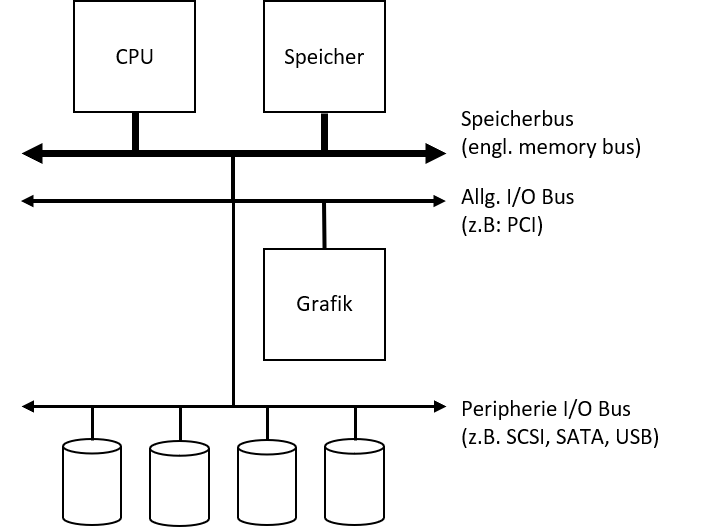
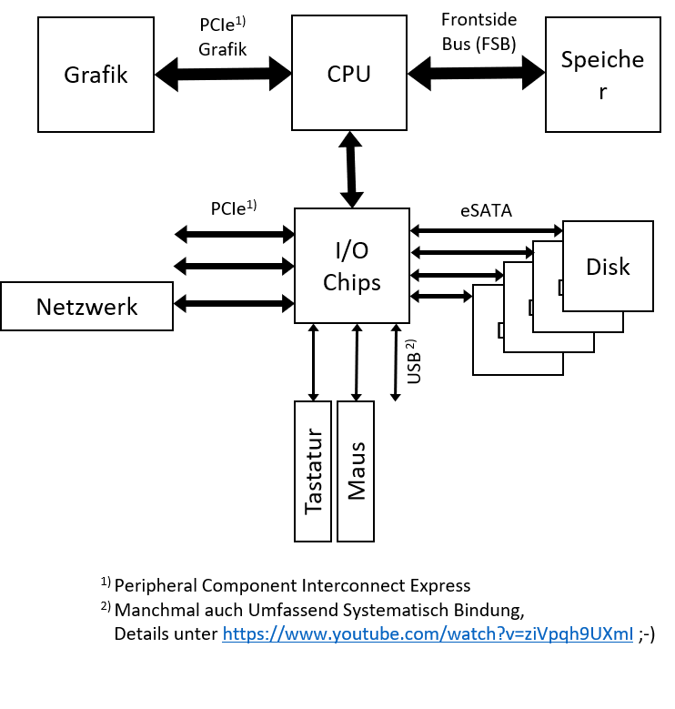
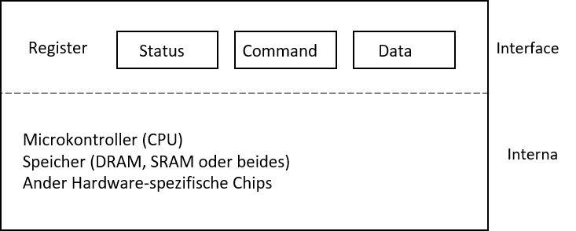
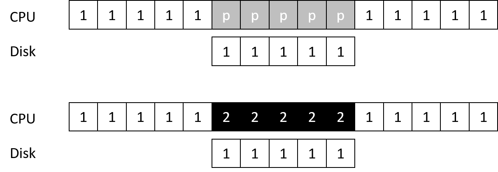
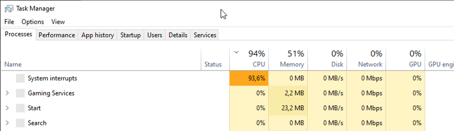
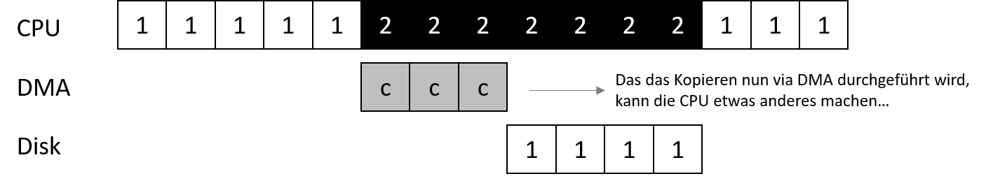
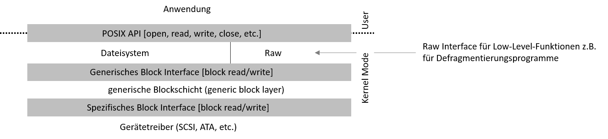
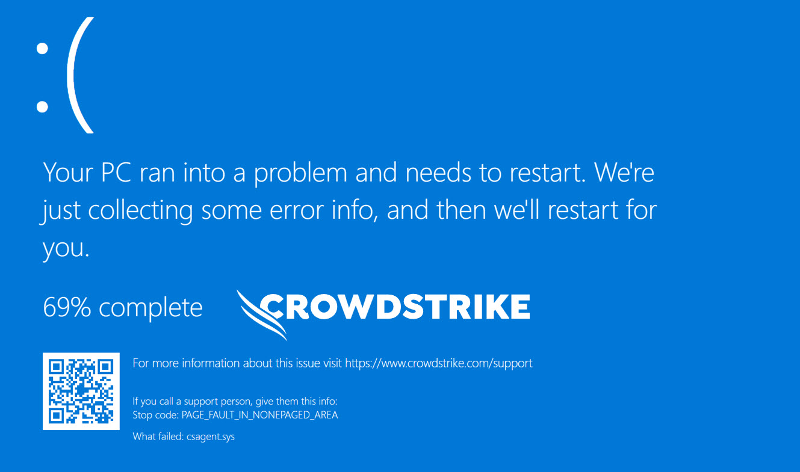

# Input / Ouput

## Lernziele

* **Verstehen** wie I/O Devices grundsätzlich aufgebaut sind und wie sich diese in das Betriebssystem integrieren

## Bus-Systeme

* Was wäre ein Programm ohne Eingabe? Es lieferte immer die gleiche Antwort.
* Was wäre ein Programm ohne Ausgabe? 🤔
* Ein- und Ausgabe stellt somit einen zentralen Aspekt von Rechnern dar.
* Wie lässt sich Ein- und Ausgabe in ein System integrieren?
* Was sind die grundlegenden Mechanismen ?
* Wie können diese effizient umgesetzt werden?
* Welche Aufgabe hat hierbei das Betriebssystem?

### Anbindung

Zunächst stellt sich die Frage, wie ein Gerät an den Rechner angebunden wird...

* Normalerweise über ein **Bus**
* Wir unterscheiden zwischen
  * **Speicherbus** zur schnellen Anbindung des Hauptspeichers
  * Einem **allgemeinen I/O-Bus** zur systeminternen Kommunikation (bei modernen Geräten ist dies PCI)
  * **Peripherie-Bus** (z.B. SCSI, SATA oder USB)
* Warum aber brauchen wir mehrere solche Bus-Systeme?
* Grund ist die Physik, die Kosten sind hier die maßgeblichen Größen
  * Je schneller der Bus, desto kürzer
  * Je schneller der Bus, desto teurer

## **Ein-/Ausgabegeräte**

Geräte zur Ein- und Ausgaben (engl. input/output devices, oder kurz I/O devices) hängen stark von der Systemarchitektur ab.

* Wie sollte I/O grundsätzlich in das System integriert werden?
* Was sind die grundlegenden Mechanismen?
* Wie können I/O-Operationen effizient gehandhabt werden?

<figure><figcaption></figcaption></figure>

### **I/O Chips**

* Moderne Architekturen nutzen daher spezielle I/O Chips zum schnellen Routen von Daten
* Beispiel für einen solchen Chip ist Intel DMI (Direct Media Interface)
* Anbindung von Festplatten via eSATA (external SATA) als Weiterentwicklung von SATA (Serial ATA) als Weiterentwicklung von ATA bzw. IBM AT Attachment (2. IBM PC Generation mit 6 MHz Intel 80286 CPUs)
* USB – Universal Serial Bus für sog. Low Performance Devices


<figure><figcaption></figcaption></figure>

## Canonical Device

* Grundlegendes (allgemeingültiges) Konzept eines Gerätes
  * Besteht aus zwei wichtigen Komponenten:
  * Hardware Interface, über den das das Gerät angesteuert werden kann
* Was steckt alles in einem Gerät?
  * Stark Implementierungsabhängig
  * Ein paar Chips, komplexere Geräte sogar mit einer eigenen CPU
  * Allgemeiner Speicher und weitere Chips<br>

<figure><figcaption></figcaption></figure>

## Canonical Protocol

Benötigt wird ein allgemeingültiges Protokoll zur Ansteuerung von I/O-Geräten.

* Im Beispiel zuvor: 3 Register
  * Status Register: Ermöglicht es, den Status des Geräts auszulesen
  * Command Register: Ermöglicht es, dem Gerät mitzuteilen, welche Aktion als nächstes ausgeführt werden soll
  * Data Register: Ermöglicht es Daten ins Gerät zu übermitteln
  * Durch Schreiben/Lesen dieser Register wird die Interkation mit dem Gerät ermöglicht

### **Das Protokoll in 4 Schritten**

1. Warten bis das Gerät bereit ist
2. Daten in Register schreiben
3. Kommando in Register schreiben
4. Warten bis Gerät fertig ist


```
//while (STATUS == BUSY) ; // wait until device is not busy
write data to DATA register
write command to COMMAND register
(starts the device and executes the command)
while (STATUS == BUSY) ;
// wait until device is done with your request
```

### Polling

* Das Status Register fortwährend auszulesen, wird auch **Polling** genannt
* Im Grund wird andauernd gefragt: „Ey Digga, was geht?!“
* Abhängig von der Größe des Daten Registers sind hier mehrere Durchläufe erforderlich, bis alle Daten geschrieben sind

### **PIO**

Kennt man vom Arduino oder Raspberry PI... aber was steckt dahinter?

* Sobald die CPU (hier meinen wir die CPU vom Rechner, nicht vom I/O Gerät) für das "Hin- und Herschippern" der Daten genutzt wird, sprechen wir von &#x50;_**rogrammed I/O**_ (Abk. PIO)
  * Das Canonical Protokoll funktioniert im Grunde ABER
  * Polling ist kostenintensiv
    * es verschwendet CPU Cycles
    * es verlangsamt oder blockiert die Ausführung anderer Prozesse
    * es führt die Idee des Overlapping beim Scheduling ad absurdum

### **Interrupts**<br>

* Idee: Den CPU Overhead mittels Interrupts reduzieren
* Grundsätzliche Funktionsweise:
  * Betriebssystem stellt eine Anfrage an ein Gerät
  * Der aufrufende Prozess wird schlafen geschickt
  * Betriebssystem führt einen Kontext-Switch zu einem anderen Prozess aus
  * Sobald das Gerät fertig ist, wird ein Hardware Interrupt ausgelöst
  * Der Interrupt veranlasst das Betriebssystem eine vordefinierten _Interrupt Service Routine_ (ISR) bzw. _Interrupt Handler_ auszuführen.

### **Polling vs Interrupts**

In dem ersten Beispiel pollt die CPU, bis das Gerät fertig ist.

Mit einem Interrupt könnte die CPU in der Zwischenzeit etwas anders (sinnvolles) machen (zweites Beispiel).<br>

<figure><figcaption></figcaption></figure>

### **Performance**

* Interrupts sind nicht immer die beste Lösung
  * Wenn das Gerät so schnell ist, dass beim ersten Poll die Antwort käme, machen Interrupts das System langsamer
  * Der damit zusammenhängenden Context Switch ist im Verhältnis zum „kurz Warten“ teurer

### **Livelocks**<br>

Zu viele Interrupts können das System auch überlasten

In diesem Fall sprechen wir von einem _Livelock._

<figure><figcaption></figcaption></figure>

### **Lösungsidee: Hybrid Ansatz**

Die Lösung zum, vorherigen Problem: Zwei Phasen

* Für einen kurzen Zeitraum pollen
* Wenn das Gerät nicht geantwortet hat einen Interrupt nutzen

Ein konkretes Beispiel:Ein Web-Server erhält plötzlich (extrem) viele Anfragen. Wenn nun bei eintreffenden Paketen nur noch Interrupts ausgelöst werden, läuft im Prinzip kein Prozess mehr im User-Space. Daher wäre es besser den Web-Server selbst entscheiden zu lassen wann er neue Pakete entgegen nimmt.

### **Alternativer Lösungsansatz: Coalesing**

> Nachteil: Zu langes Warten kann zu einer erhöhten Latenz des Gerätes führen

* Wenn ein Gerät fertig ist, wird der Interrupt nicht sofort ausgelöst!
  * Anstelle dessen wartet das Gerät einen Moment ob bzw. bis weiter Anfragen abgearbeitet sind
  * Nun werden alle bearbeitet Requests gebündelt zurück geliefert, in dem der Interrupt nur einmal ausgelöst wird

## DMA

Nicht nur das Polling auch bei anderen Aufgaben wird die CPU für eigentlich triviale Aufgaben in Anspruch genommen: z.B. das Kopieren von Daten in die Daten Register.

> Frage: Wie kann der CPU Arbeit abgenommen werden, damit die CPU effizienter genutzt werden kann? Ganz einfach: Kopieren der Daten

\
**DMA: Direct Memory Access**

* Eine separate DMA Engine orchestriert den Datenfluss zwischen Gerät und Hauptspeicher
  * Funktionsweise: Das Betriebssystem programmiert die DMA Engine mit
    * Speicherort an dem die Daten liegen
    * Wie viele Daten kopiert werden sollen
    * An welches Gerät die Daten geschickt werden sollen und ist jetzt quasi fertig!

<figure><figcaption></figcaption></figure>

## Kommunikation mit dem Gerät

Nun stellt sich noch die Frage, wie die ganzen Geräte mit ihren spezifischen Hardware Interfaces in das Betriebssystem passen?

> Ziel: Betriebssystem so gut wie es geht geräteneutral halten, also die Details der Geräteinteraktion vom Betriebssystem „verstecken“.

Lösung: Wie so oft in der Informatik hilft uns hier die _Abstraktion_!<br>

<figure><figcaption></figcaption></figure>

### Gerätetreiber

Die gerätespezifische Funktionalität wird als Gerätetreiber ausgeliefert.

Nachteil: Durch die generische Schnittstelle können nicht immer alle (tollen) Funktionen eines Geräts genutzt werden.

Beispiel: SCSI Error-Funktionalität ist unter Linux über die einfachere ATA/DIE Schnittstelle nicht nutzbar.

Bedeutung von Gerätetreibern: Bis zu 70% des Codes eines Betriebssystems (Linux und Windows annähernd gleich viel) steckt heute inzwischen in Gerätetreibern.

**Problem**: Dieser Code wird nicht von Kernel-Entwicklern gebaut. Fehlern im Gerätetreiber, die im Kernel-Mode laufen, können unter Windows einen Bluescreen ([BSoD](https://weblogs.asp.net/wallym/77425)) verursachen. Ob die Ursache an Windows oder einem Gerätetreiber lag, ist dem Anwender nicht zwingend ersichtlich.

### Exkurs: Crowdstrike BSoD

Juli 2024 konnten Millionen von PCs aufgrund eines Updates der Firma Crowdstrike nicht mehr starten. Das Problem betraf Flughäfen, Warenhäuser, Krankenhäuser und viele weitere Einrichtungen weltweit. Aus der Fehlermeldung war den Anwendern jedoch nicht klar, worin das eigentliche Problem lag. Offensichtlich war: Windows startet nicht mehr.

Das Problem lag in CrowdStrike’s `csagent.sys` und wurde durch ein fehlerhaftes Update der Sicherheitssoftware verursacht. Dieses Update führte dazu, dass mehrere Millionen von Windows-Systemen weltweit nicht mehr gestartet werden konnten. Die betroffenen Geräte zeigten einen Bluescreen of Death (BSOD) mit der Fehlermeldung `PAGE_FAULT_IN_NONEPAGED_AREA` an, ausgelöst durch die Datei `csagent.sys`.

Erste forensische Analysen des Memory Dumps des Blue Screen of Death (BSOD) deuten darauf hin, dass das Problem auf einen sogenannten Null-Pointer-Fehler in CrowdStrike’s `csagent.sys` zurückzuführen ist. Der Code versuchte anscheinend, auf eine ungültige Speicheradresse (`0x9c` bzw`156`) zuzugreifen ([heise.de](https://www.heise.de/hintergrund/Fataler-Fehler-bei-CrowdStrike-Schuld-war-ein-Null-Pointer-9807896.html)).

Eine Möglichkeit für mehr Transparenz, wäre ein BSoD, der z.B. direkt zur Hersteller-Seite verweist:

<figure><figcaption><p>Concept design of a better BoSD. Cleary indicating the cause of the error and pointing to the direct support. Remark: This is a conceptual BSoD, indicated for teaching purposes only. Create with: <a href="https://bsodmaker.net/">https://bsodmaker.net/</a></p></figcaption></figure>


<br>
