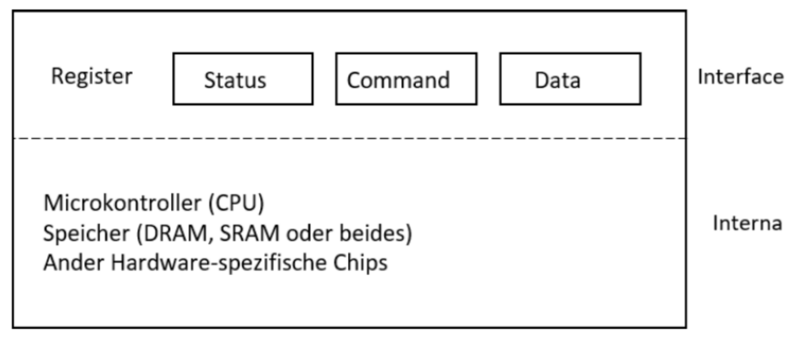

# Lab 04: Canonical Treiber Implementierung

### Voraussetzungen

Ihr Gerät verfügt über die drei Register Status, Command und Data.

Implementieren Sie den Zugriff auf Ihr Gerät mittels einem **Thread**, d.h. das virtuelle Gerät wird als Thread gestartet. Nutzen Sie zur Synchronisation Mechanismen aus der vorlesung (z.B. the Thread-API oder eine Semaphore oder Conditional zur Signalisierung). Das Steuern des virtuellen Gerätes soll nur über das Interface erfolgen.

<figure><figcaption></figcaption></figure>

### Teilaufgabe 1: Interface Implementierung

Realisieren Sie das folgende Interface auf basis folgender Header-Datei (`interface.h`):

```c
char getStatus();
void setStatus(char newStatus);

char getCommand();
void setCommand(char newCommand);

char getSharedData(int index);
void setSharedData(int index, char data);

// data stored in the virtual device
// can not be accessed from another thread other than the virtual device
char getInternalData(int index);
void setInternalData(int index, char data);
```

Das Interface wird während der automatisierten Tests duch eine andere Implementierung ersetzt. Sie können also nicht direkt auf die Daten zugreifen.

Das Feld `status` kann folgende Werte besitzen:

* busy: `01`
* ready: `00`
* error: `02`

Das Feld `command` kann folgende Werte besitzen:

* idle: `00`
* read: `01`
* write: `02`
* reset: `04`
* delete: `08`

Die Felder `status`als auch `command` sind jeweils ein Byte groß.

Das Feld `sharedData` hat eine Länge von 20 Byte.

Das Feld `internalData` hat eine länge von 1.024 Byte.

### Teilaufgabe 2: Treiber Implementierung

* Wird von Extern das Command-Register auf _write_ gesetzt, liest der Treiber die Daten aus dem Data-Register und schreibt diese in den internen Speicher
* Der interne Speicher in Ihrem Gerät soll 1.024 Byte betragen.
* Die Daten werden in Ihrem Gerät fortlaufend in den internen Speicher geschrieben. Ist der Speicher voll wird der Status auf _error_ gesetzt. (Bisher geschriebene Daten bleiben erhalten.)
* Wird von Extern das Command-Register auf _read_ gesetzt, liefert der Treiber die Daten. Die Daten werden dabei fortlaufend geschrieben.
* Wird zwischen Lese- und Schreibvorgang gewechselt, startet der Lese- bzw. Schreibvorgang immer am Anfang des internen speichers (also bei Adresse 0).
* Wird das Command-Register auf _reset_ gesetzt, startet sowohl Lese- als auch Schreibvorgang wieder bei der Adresse 0.
* Wird von Extern das Command-Register auf _delete_ gesetzt, löscht das Gerät sämtliche gespeicherte Daten.

### Teilaufgabe 3: Aufrufer Implementieren

* Implementieren Sie auf Basis folgender Header-Datei (`device.h`):

```c
#include <pthread.h>

// start the virtual device thread
void device_start(pthread_t *thread);
// exit the virtual device thread
void device_kill(pthread_t thread);
// write buffer to the virtual device the buffer is bufferLength large
void device_write(char* buffer, int bufferLength);
// read the data from the device thread and return the size of the read data
int device_read(char ** buffer);
// reset the device (clear errors)
void device_reset();
// delete the stored data (do not clear errors)
void device_delete();
```

Zum Entwickeln/Testen können Sie folgende main implementieren.

* Schreiben Sie in den Internen Speicher des Gerätes 512 Byte Daten, danach soll der gesamte Speicherinhalt aus dem Gerät ausgelesen und ausgegeben werden.
* Löschen Sie nun den Inhalt des Gerätes und schreiben Sie nun 2048 Byte in Ihr Gerät, danach soll der Inhalt des Gerätes ausgelesen und ausgegeben werden.
* Setzen Sie nun das Gerät zurück und schreiben 256 Byte in Ihre Gerät. Danach wird der gesamte Speicherinhalt aus dem Gerät ausgelesen und ausgegeben werden.

## Voraussetzungen

\
Nutzen Sie hierfür [gcc](https://gcc.gnu.org/).

Sie können _gcc_ unter Linux und/oder macOS direkt verwenden. Unter Linux installieren Sie _gcc_ über Ihren Paket-Manager, unter macOX über [Homebrew](https://brew.sh/).

Nutzen Sie Windows 10 können Sie entweder eine Linux in einer virtuellen Maschine (z.B. in [VirtualBox](https://www.virtualbox.org/)) nutzen, oder direkt das [Windows Subsystem for Linux (WSL 2.0)](https://docs.microsoft.com/en-us/windows/wsl/install-win10) nutzen. Alternativ ist es möglich _Windows Subsystem for Linux_ über den Windows App Store zu installieren.

In der Wahl der Linux Distribution sind sie frei, alle Beispiele in der Vorlesung werden jedoch unter Ubuntu (letzter stabiler Release) bewertet und eventuell vorgestellt.

## Abgabe 4

Die Bewertung Ihrer Abgabe findet automatisch statt. Stellen Sie hierzu folgende Punkte sicher:

* Ihre Lösung befindet sich im Ordner **aufgabe4**.
* Ihre Implementierung befindet sich in folgenden Dateien:
  * für `device.h` in `device.c`
  * für `interface.h` in `interface.c`
* Zur Abgabe erhalten Sie einen Zugang zum hochschulinternen [GitLab](https://git.it.hs-heilbronn.de/).
* Ihre Lösung checken Sie in Ihrem Repository ein.
* Die eigentliche Abgabe erfolgt über das hochschuleigene [Commit-System](https://commit.it.hs-heilbronn.de/). Der Zugriff ist ausschließlich im Hochschulnetz oder über VPN möglich.

## Abgabe

* Abgaben, die nicht vollständig sind oder die Abgabekriterien nicht erfüllen werden nicht bewertet.
* Abgaben, die nicht fristgerecht eingereicht werden, werden nicht bewertet.
* Nutzen Sie zur Abgabe ausschließlich das beschriebene Verfahren. Abgaben, die per E-Mail oder anderen Wegen eingereicht werden, werden nicht bewertet.
* Abgaben, die aufgrund eines Fehlers nicht durch Tests laufen oder sich nicht kompilieren lassen, werden entsprechend mit weniger Punkten bewertet.

\


\
\
