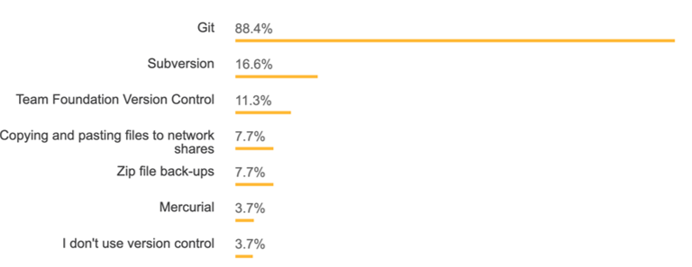

<!--

author:   Andreas Heil

email:    andreas.heil@hs-heilbronn.de

version:  0.1

language: de

narrator: DE German Male

tags: betriebssysteme, lecture, git

comment:  

-->

# Einführung in Git 
<!-- data-type="none" -->
| Parameter | Kursinformationen |
| --- | --- |
| **Veranstaltung:** | `262007 Betriebssysteme`|
| **Semester** | `SEB2` |
| **Hochschule:** | `Hochschule Heilbronn` |
| **Inhalte:** | `Einführung in Git` |
| Startseite | [https://liascript.github.io/course/?https://raw.githubusercontent.com/aheil/os/master/README.md#1](https://liascript.github.io/course/?https://raw.githubusercontent.com/aheil/os/master/README.md#1) | 
| **Link auf den GitHub:** | [https://github.com/aheil/os/blob/main/lectures/01_git.md](https://github.com/aheil/os/blob/main/lectures/01_git.md) |
| **Autoren** | @author |

## Lernziele

- Hintergründe, Sinn und Zweck von Versionsverwaltung **kennenlernen**
- Git Grundlagen **kennenlernen**
- **Verstehen** warum Git Workflows hilfreich sind

## Was ist Versionsverwaltung

Es gibt alternative Bezeichnungen:

- Version Control Systems (VCS)
- Source Control Management (SCM)
- Revision Control Systems (RCS)

Software Projekte können schnell sehr groß und unübersichtlich werden.

- Hunderte bzw. tausende von Code-Dateien 

Sehr viele Entwickler können an einem Projekt beteiligt sein. 

- Versionsverwaltungen können helfen diese Komplexität in den Griff zu bekommen, indem die Änderungen an den Dateien über die Zeit hinweg protokolliert werden.

Historie: Selbst für einzelner Entwickler sinnvoll

- Änderungen über die Zeit sehen können
- "Zurückrollen" zu einem bestimmten Zeitpunkt 
- Was wäre die Alternative? Viele (sehr viele) Kopien einer Datei?

Mehrere Entwickler

- Sehen, wer welche Änderungen gemacht hat 
- Konflikte auflösen, wenn mehrere Entwickler Änderungen an der gleichen Datei/der gleichen Zeile durchgeführt haben 

Versionierung 

- Zustand eines Projekts wiederherstellen: zum Testen, für ein Release oder um die Einführung eines Fehlers zu finden 

{{1}}
************************************

**Was nutzen Entwickler?**

Quelle: https://insights.stackoverflow.com/survey/2015

Quelle: https://insights.stackoverflow.com/survey/2018

************************************

## Git

- Linux Community nutzte BitKeeper zur Verwaltung des Kernel Source Codes 
- Durch Lizenzänderung des Herstellers konnte BitKeeper nicht mehr genutzt werden
- Linus Torvalds wollte ein System, das ähnlich BitKeeper funktionierte, aber die Nachteile der anderen Systeme nicht mehr aufwies (z.B: lange Zeiten bei Branches durch Kopieren aller Dateien)
- Innerhalb weniger Tage wurde die erste Version von Git entwickelt:
- 3. April 2005 Ankündigung des Projektes 
- 7. April 2005 Self-Hosting des Projektes 
- 16. Juni 2005 Linux 2.6 Kernel wurde durch Git verwaltet 

### Git Grundlagen

- _Git Repository_: Vereinefacht, ein Verzeichnis, in dem die Dateien “überwacht” werden
- Metadaten (einschl. der Historie) werden in einem versteckten Unterverzeichnis (.git) verwaltet.
- Git ist eine verteilte Versionsverwaltung
- Keine Notwendigkeit eines zentralen Repositories 
- _Clonen_ bzw. _Forken_ eines Repositories legt eine vollständige Kopie an. Änderungen können dann in das ursprüngliche Repository zurückgeführt ( engl. merge) werden. 

{{1}}
************************************

**Git Dateistatus**

************************************

### Nützliches für den Einstieg

Lokale Änderungen anzeigen (engl. unstaged changes): `git diff [dateiname]`

**Änderungshistorie**: `git log` für Commits, `git –p log` für ein Preview

**Checkout**: Der Checkout einer früheren Version eines Repositories ersetzt alle Dateien mit dieser Version (time travel)

**Branches**: Alle Änderungen werden in dem Branch (dt. Zweig) gespeichert ohne den Hauptzweig (engl. master branch) zu beeinflussen („kaputt zu machen“)

**Remote**: “Entfernte“ Kopie eines Repositories (z.B: GitLab, GitHub) – Achtung: Selbst auf GitLab/GitHub ist nicht das zentrale 
Repository, sondern nur eine entfernte Kopie z.B. mit `git push`, `git pull`

**Stash**: Änderungen, die noch nicht comittet wurden, können mit `git stash` „zwischengespeichert“ und mit `git stash apply` wieder hergestellt werden

**Fork**: Server-seitiger Clone eines Repositories

### Git Workflows 

Trotz oder gerade wegen der verteilten Verwaltung kann so einiges schief gehen, daher gilt

Bildquelle: https://imgflip.com/

Verschieden Ansätze für Git Workflows

- Centralized Workflow
- Feature Branch Workflow
- Gitflow
- Fork & Merge
- Microsoft Git Branching Strategy  

## Weiterführendes Material 

- Git Command-line Tool: https://github.com/nschneid/git-command-overview
- GitHub: https://github.com/
- GitLab: https://about.gitlab.com/ 
- The case for Git in 2015: http://www.netinstructions.com/the-case-for-git/
- Pro Git Book: http://git-scm.com/book
- Udacity Kurs*): https://www.udacity.com/course/version-control-with-git--ud123
- Git User‘s Manual: http://schacon.github.com/git/user-manual.html
- Git – SVN Crashcourse: http://git.or.cz/course/svn.html
- Learn Git in Y minutes: https://learnxinyminutes.com/docs/git/ 
- Coding Blocks Podcast: Comparing Git Workflows: https://www.codingblocks.net/podcast/comparing-git-workflows/ 
- Gitflow Cheatsheet: https://danielkummer.github.io/git-flow-cheatsheet/ 
- Gitflow: https://nvie.com/posts/a-successful-git-branching-model/ 
- Atlassian‘s Gitflow Zusammenfassung: https://www.atlassian.com/git/tutorials/comparing-workflows/gitflow-workflow
- Microsoft Recommendation: https://docs.microsoft.com/en-us/azure/devops/repos/git/git-branching-guidance?view=azure-devops&viewFallbackFrom=vsts
- Git Workflows: http://drincruz.github.io/slides/git-workflow-comparison/#/8 
- Git Spiel Oh my Git! :[https://ohmygit.org/](https://ohmygit.org/)
- Auschecken von Commits: https://www.git-tower.com/learn/git/faq/git-checkout-commits/
- Wenn was schief geht: https://ohshitgit.com/ 
- Learn Git Branching: https://learngitbranching.js.org/

