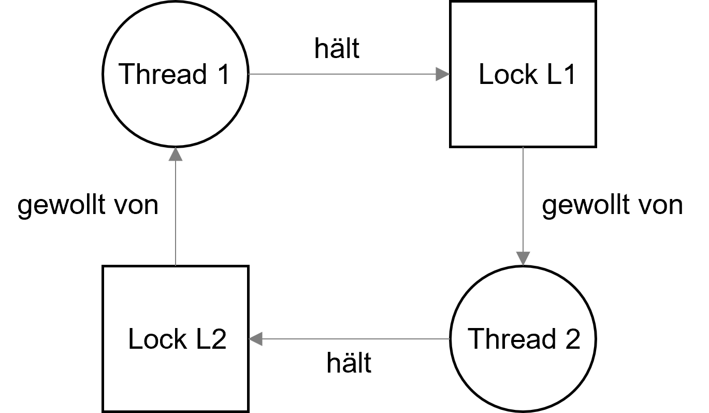
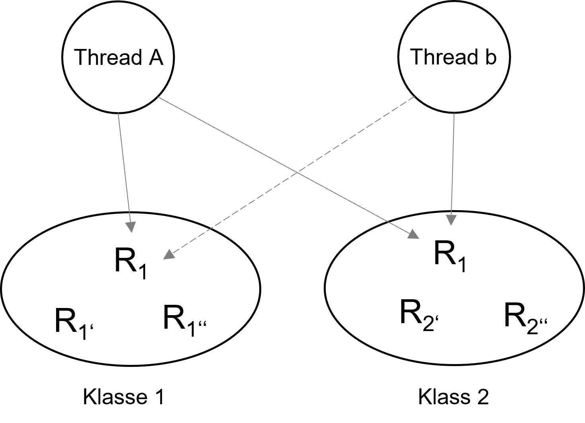
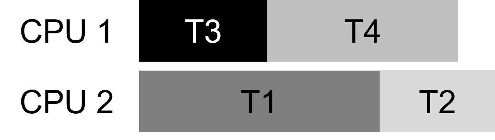

<!--

author:   Andreas Heil

email:    andreas.heil@hs-heilbronn.de

version:  0.1

language: de

narrator: DE German Male

tags: betriebssysteme, lecture, i/o, input/output

comment:  

-->


# Input/Output

<!-- data-type="none" -->
| Parameter | Kursinformationen |
| --- | --- |
| **Veranstaltung:** | `262007 Betriebssysteme`|
| **Semester** | `SEB2` |
| **Hochschule:** | `Hochschule Heilbronn` |
| **Inhalte:** | `Bugs durch Nebenläufigkeit` |
| Startseite | [https://liascript.github.io/course/?https://raw.githubusercontent.com/aheil/os/master/README.md#1](https://liascript.github.io/course/?https://raw.githubusercontent.com/aheil/os/master/README.md#1) | 
| **Link auf den GitHub:** | [https://github.com/aheil/os/blob/main/lectures/09_1_nebenlaeufigkeit.md](https://github.com/aheil/os/blob/main/lectures/09_1_nebenlaeufigkeit.md) |
| **Autoren** | @author |

## Bugs durch Parallelität 

<!-- data-type="none"  -->
|Anwendung|Typ|Non-Deadlock|Deadlock|
|MySQL|Datenbank|14|9|
|Apache|Web Server|13|4|
|Mozilla|Wen Browser|41|16|
|OpenOffice|Office Suite|6|2|

Basierend auf einer Studie [1] lassen sie die Fehler zunächst nach Deadlock und Nicht-Deadlock Fehlern aufgliedern. 1/3 der Fehler lassen sich dabei auf Deadlocks zurückführen.

Warum ist das interessant? Zu verstehen wo die Fehler herkommen ermöglicht es uns bessere und robustere Software zu schreiben. Da gilt übrigens nicht nur für Betriebssysteme!  

Noch einige Daten aus der Studie:

- Sucht man nach den obigen beiden Fehlern, findet man den größten Teil der Nicht-Deadlock-Fehler
- Die meisten Nebenläufigkeitsfehler entstehen durch 1 oder 2 Threads (also nicht durch viele Threads) 
- Mehr als 20% der Deadlock-Fehler entstehen in einem einzigen Thread
- Die meisten Deadlock-Fehler entstehen durch den Zugriff auf nur 1 oder 2 Ressourcen 

## Atomic Violation und Order Violation

Zwei Fehlerklassen bei Nicht-Deadlocks sind für uns von besonderem Interesse: 

- **Atomic Violation** (Zugriff auf eine geschützte Ressource)
- **Order Violation** (Einhaltung einer Reihenfolge)

### Atomic Violation

Diese Fehler haben wir bereits kennen gelernt 

Beispiel aus MySQL:

Thread 1:

```c
if (thd->proc_info) {
  fputs(thd->proc_info, ...);
}
``` 

```c 
Thread 2:

thd->proc_info = NULL;
```

- Thread 1 prüft auf Nicht-Null, um dann einen Wert zu setzen 
- Wird Thread 1 nach der Prüfung (also vor dem Setzen des Wertes unterbrochen) und Thread 2 setzt den Pointer auf Null, dann passiert was? 
- Referenz ist auf Null gesetzt und wenn Thread 1 wieder läuft, wird das Programm vermutlich abstürzen…

{{1}}
************************************

> **Definition Atomic Violation**: The desired serializability among multiple memory accesses is violated (i.e. a code region is intended to be atomic, but the atomicity is not enforced during execution).” [1]

**Lösung:** Den kritischen Abschnitt durch ein Lock (Mutex, binäre Semaphore) schützen.

************************************

### Order Violation

Thread 1:

```c
void init() {
  mThread = PR_CreateThread(mMain, ...);
}
``

Thread 2:

```c
void mMain(...) {
  mState = mThread->State;
}
```

Was passiert hier? 

- Thread 2 geht davon aus, dass `mThread` bereits initialisiert ist (d.h. 0!= Null)
- Wenn Thread 2 sofort läuft, nachdem er erzeugt wurde, konnte Thread 1 die Referenz aber noch nicht zuweisen
- Ist das klar warum? Thread 1 wurde dann ja direkt vor der Zuweisung unterbrochen…

{{1}}
************************************

> **Definition: Order Violation:** The desired order between two (groups of) memory accesses is flipped (i.e., A should always be executed before B, but the order is not enforced during execution)” [1]

**Lösung:** Die Reihenfolge kann durch Condition Variables sichergestellt werden.

************************************

### Fazit Nicht-Deadlock-Fehler

- 97% der nicht auf Deadlocks basierenden Fehler sind die beiden zuvor behandelten Fehlertypen (Atomic Violation bzw. Order Violation)
- Statische Code-Analyse kann hier helfen die Fehler vorzubeugen 
- Die Fehler sind oft nicht leicht zu finden
- Die Fehlerbehebung erfordert oft das Refactoring größerer bzw. großer Mengen von Code oder von Datenstrukturen

## Deadlocks

Wie entsteht eigentlich ein Deadlock? 

Beispiel:

Thread 1: 

```c
pthread_mutex_lock(L1); 
pthread_mutex_lock(L2);
```

Thread 2:

```c
pthread_mutex_lock(L2); 
pthread_mutex_lock(L1);
```

- Thread 1 hält Lock `L1`, wartet auf Lock `L2`, allerdings hält Thread 2 das Lock `L2` und wartet auf `L1` 
- Problem: Der Deadlock muss nicht zwangsweise auftreten 



{{1}}
************************************

**Ursachen für Deadlocks:**

- Komplexität von Programmen – am Beispiel Betriebssysteme und dem Zugriff auf Ressourcen vermutlich intuitiv sichtbar 
- Kapselung: Versteckt Implementierungsdetails vor dem Aufrufer… aber auch andere Dinge. Beispiel Java Vector Klasse:

```java
Vector v1, v2;
v1.AddAll(v2); 
```
- Methode muss multi-thread-safe sein
- Daher wird ein Lock für beide Variablen (`v1` und `v2`) angefordert
- Ruft ein anderer Thread nun `v2.AddAll(v1)` auf besteht Potential für ein Deadlock

************************************

{{2}}
************************************

**Bedingungen für Deadlocks** 

Damit ein Deadlock entstehen kann müssen vier Bedingungen entstehen:

- **Mutual Execlusion:** Threads fordern exklusiven Zugriff auf eine Ressource an
- **Hold-an-Wait:** Threads halten Ressourcen, die sie einmal erhalten haben (z.B. Locks) wenn Sie auf weitere Ressourcen (z.B. zusätzliche Locks) warten
- **No Preemtion:** Ressourcen können einem Thread nicht (gewaltsam) entzogen werden
- **Circular Wait** Es existiert eine zirkuläre Beziehung zwischen Threads, die eine oder mehrere Ressourcen blockieren, die von anderen Threads in dieser Kette angefordert werden (vgl. Grafik zuvor)

> Anders ausgedrückt: trifft eine der Bedingungen nicht zu, kann kein Deadlock entstehen, das kann helfen, wenn man versucht Deadlocks zu vermeiden. Wir müssen nämlich nur eine er vier Bedingungen auflösen!

************************************

{{3}}
************************************

**Circular Wait**

Einfache und weit verbreitet Methode:

- Totale Ordnung (engl. total ordering) bei Locks einhalten: Gibt es mehrere Locks können diese immer nur nacheinander angefordert werden
- Bsp: Gibt es nur zwei Locks (L1 und L2) muss L1 immer erst angefordert werden, bevor L2 angefordert werden kann 
- Problem: Ist in größeren Systemen nur schwer umsetzbar 
- Daher: Partielle Ordnung (engl. partial ordering), d.h. bestimmte Reihenfolgen, die eingehalten werden müssen
- Wird für Speicher-Mapping-Code in Linux genutzt oder auch bei FreeBSD für den Zugriff auf Ressourcen

************************************

{{4}}
************************************

**Partial Ordering in FreeBSD**

FreeBSD nutzt Partial Ordering bei allen Locks unter folgenden Bedingungen [2]:

1. „A thread may acquire only one lock in each class.“
2. „A thread may axquire only a lock in a higher-numbered class that the highest-numbered class for which it already holds a lock.“

Der FreeBSD Kernel hat zur Überwachung der Locks, der Reihenfolge und dem Debugging hierfür ein eigenes Modul (engl. witness modue).



************************************

{{5}}
************************************

**Hold-and-Wait**

Wie kann vermieden werden, dass ein Thread auf eine Ressource wartet und dabei selbst alle Ressourcen blockiert, auf die er aktuell ein Lock hält? 

Einfachste Lösung: Alle benötigten Ressourcen werden atomar, auf einmal angefordert: 

```c
thread_mutex_lock(prevention); // begin acquisition
pthread_mutex_lock(L1);
pthread_mutex_lock(L2);
...
pthread_mutex_unlock(prevention); // end

```

Probleme:
- Es muss bekannt sein, welche Ressourcen alle benötigt werden 
- Wirkt der Funktionsweise der Nebenläufigkeit entgegen, da Ressourcen nicht erst dann angefordert werden, wenn sie benötigt werden 

************************************

{{6}}
************************************

**No Preemption**

Beim Anfordern mehreren Locks kommt es oft vor, dass man beim warten auf ein Lock ein anderes Lock noch hält.

`pthread_mutex_trylock()` liefert einen Fehler, wenn ein Lock nicht verfügbar ist und umgeht das Problem somit

```
top:
  pthread_mutex_lock(L1);
  if (pthread_mutex_trylock(L2) != 0) {     
    pthread_mutex_unlock(L1);
    goto top;
  } 

```

************************************

{{7}}
************************************

**Live Lock**

Die Lösung vorher führt zu einem anderen Problem: 

- Was, wenn nun ein anderer Thread die Locks in genau der anderen Reihe anfordert  
- Beide Threads versuchen (vergebens) ständig ein Lock anzufordern
- Kein Deadlock, aber Programm läuft trotzdem nicht weiter, ein sog. **Livelock** entsteht
- Ein möglicher Lösungsansatz: Im trylock-Aufruf eine zufällige Zeit warten, bis die Routine zurückkehrt, um dem anderen Thread Zeit zu geben das Lock freizugeben 

************************************

{{8}}
************************************

**Mutual Exclusion**

Grundsätzliche Idee: Überhaupt keinen gegenseitigen Ausschluss entstehen lassen 

- Sog. _lock-free_ bzw. _wait-free_ Datenstrukturen (mit Hardware-Unterstützung) entwerfen 
- Anstelle ein Lock zu setzen und dann eine Variable zu setzen, kümmert sich die Hardware darum den Wert zu setzen (bzw. versucht es solange bis es funktioniert)
- Leider ist der Ansatz recht kompliziert

Ein ausführliches Beispiel mittels TestAndSwap in OSTEP Kapitel 32.3


************************************

{{9}}
************************************

**Scheduling zur Deadlock-Vermeidung**

Sofern der Scheduler weiß, auf welche Ressourcen ein Thread zugreift, kann durch geschicktes Scheduling ein Deadlock vermieden werden.

Beispiel: Threads T1-T4 nutzen Locks L1 und L2 wie folgt

<!-- data-type="none"  -->
||T1|T2|T3|T4|
|L1|ja|ja|nein|nein|
|L2|ja|ja|ja|nein|

Also: Solange T1 und T2 nicht gleichzeitig laufen, kann kein Deadlock entstehen



************************************

{{10}}
************************************

**Detect and Recover**

Eine ganz andere Möglichkeit: 

- Deadlocks dürfen ab und an auftreten, müssen dann aber behoben werden. 
- Hierfür müssen alle Ressourcen (Locks) überwacht und regelmäßig ausgewertet werden
- Wie? Es wird ein Graph erstellt und dieser auf Zyklen überprüft. Hier nochmal der Hinweis warum Sie später so etwas in Algorithmen und Datenstrukuren lernen…  
- Die Frage nun: was machen wenn ein Deadlock aufgetreten und erkannt wurde? 

  - Eine Möglichkeit: Reboot 
  - Das ist vielleicht OK für ein Programm, eine Datenbank, vielleicht gerade noch so für das Betriebssystem eines PCs, aber wie schaut es mit der Software in einem Flugzeug aus?


************************************

## Referenzen

[1]: “Learning from Mistakes — A Comprehensive Study on Real World Concurrency Bug Characteristics” by Shan Lu, Soyeon Park, Eunsoo Seo, Yuanyuan Zhou. ASPLOS ’08, March 2008, Seattle, Washington

[2] The Design and Implementation of the FreeBSD Operating System, Marshall Kirk McKusick, George V. Neville-Neil, Robert N.M. Watson, 2014, ISBN 978-0321968975
